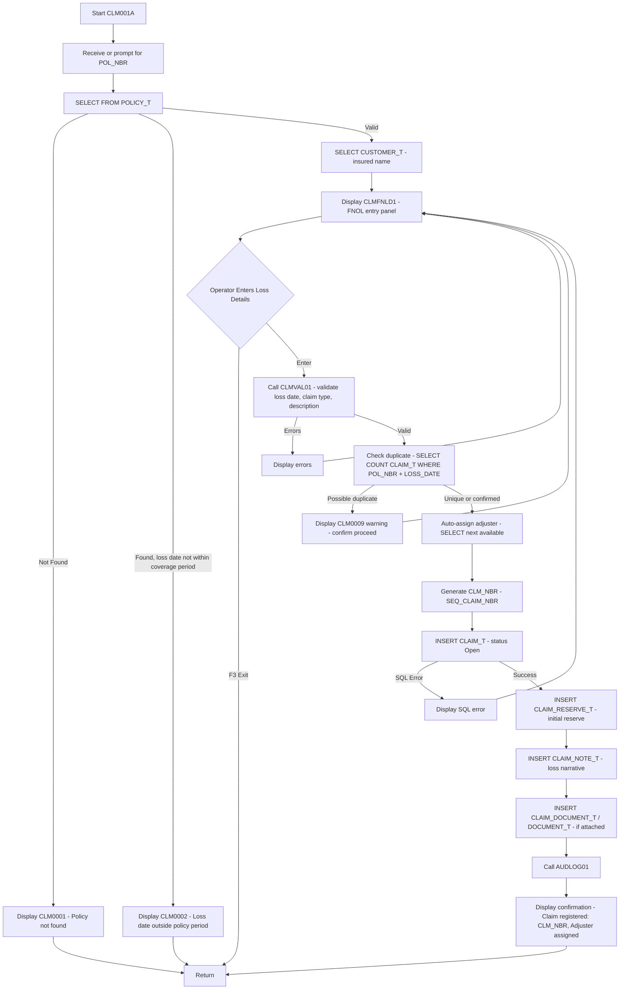
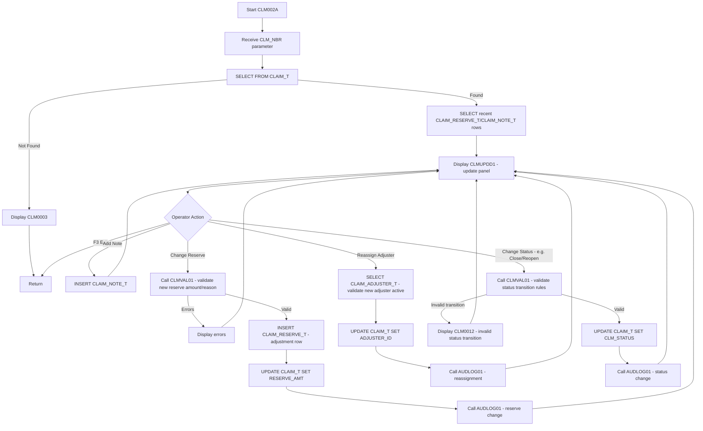
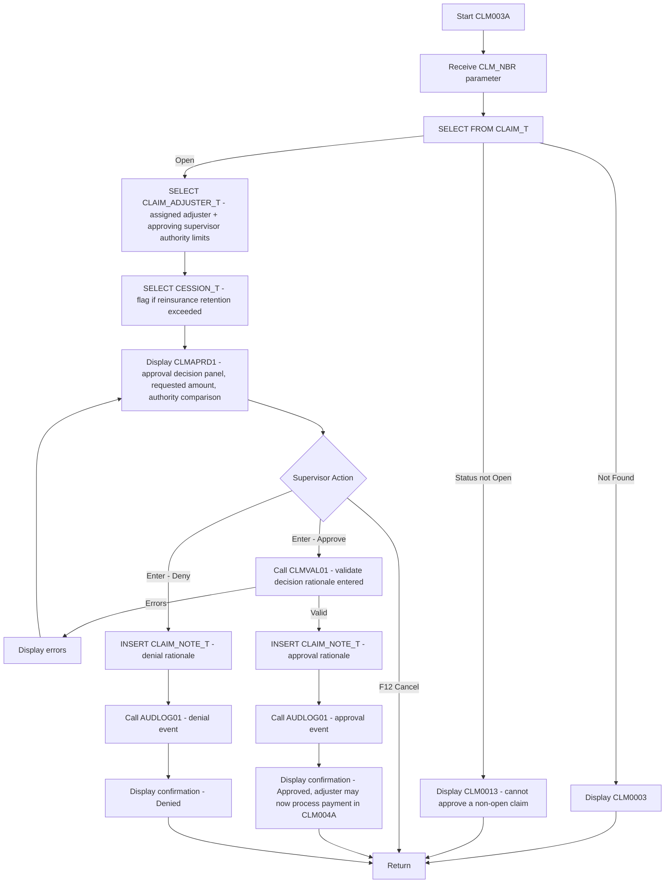
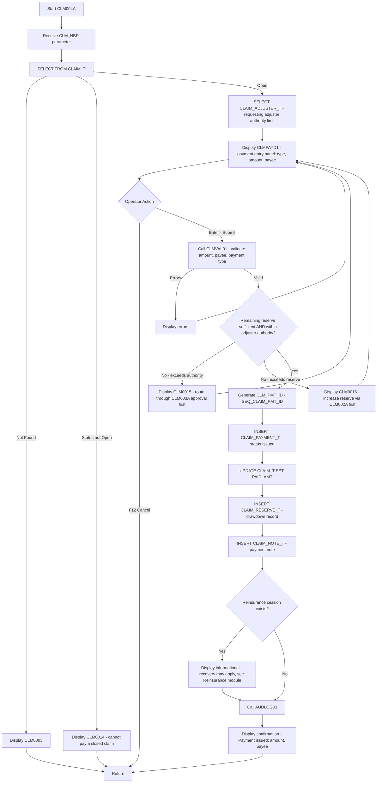
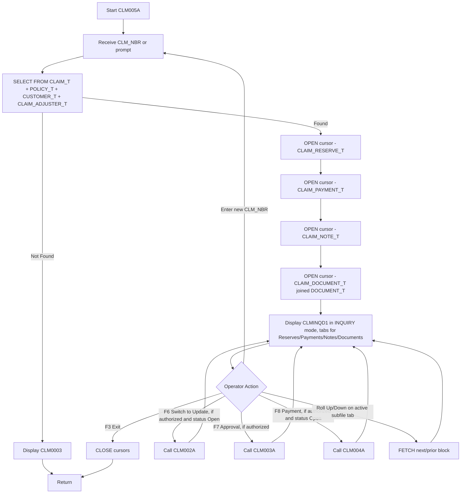
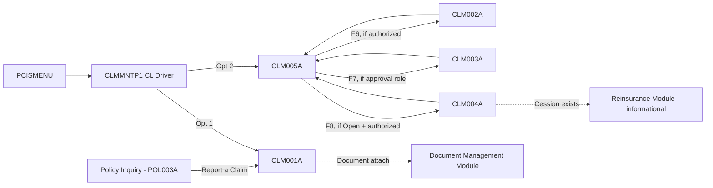

# PCIS — Claims Management Module (CLM) — Design Document

**Scope:** Design-level specification only. No COBOL/DDS/SQL source code is generated in this phase.

---

## 1. Module Overview

| Item | Value |
|---|---|
| Module Code | CLM |
| Library (Dev) | INSDEV |
| Source Files | QCBLSRC (COBOL), QDDSSRC (DDS), QSQLSRC (SQL DDL) |
| Primary Table | CLAIM_T (+ CLAIM_RESERVE_T, CLAIM_PAYMENT_T, CLAIM_DOCUMENT_T, CLAIM_ADJUSTER_T, CLAIM_NOTE_T) |
| Programs | CLM001A, CLM002A, CLM003A, CLM004A, CLM005A |
| Driver/Menu | CLMMNTP1 (CL), invoked from PCISMENU |
| Audit Target | AUDIT_LOG_T (via AUDLOG01) |
| Dependencies | POLICY_T, CUSTOMER_T, CLAIM_ADJUSTER_T, DOCUMENT_T, REFUND_T (n/a), TREATY_T/CESSION_T (reinsurance recovery interface), BILLING_SCHEDULE_T (n/a) |

### 1.1 Program Inventory

| Program | Name | Function | Type |
|---|---|---|---|
| CLM001A | Claim Registration | First Notice of Loss (FNOL) — opens a new claim against a policy | ILE COBOL, Embedded SQL, DDS-driven |
| CLM002A | Claim Update | Adjuster maintenance — reserve changes, notes, status, adjuster reassignment | ILE COBOL, Embedded SQL, DDS-driven |
| CLM003A | Claim Approval | Supervisory approval/denial of a claim or a specific payment request, with authority-limit enforcement | ILE COBOL, Embedded SQL, DDS-driven |
| CLM004A | Claim Payment | Issues indemnity/expense payment against an approved claim, with reserve drawdown | ILE COBOL, Embedded SQL, DDS-driven |
| CLM005A | Claim Inquiry | Read-only display of claim, reserves, payments, notes, and documents | ILE COBOL, Embedded SQL, DDS-driven |

### 1.2 Supporting Objects

| Object | Name | Purpose |
|---|---|---|
| Display File | CLMFNLD1 | FNOL entry panel (CLM001A) |
| Display File | CLMUPDD1 | Claim update / adjuster maintenance panel (CLM002A) |
| Display File | CLMAPRD1 | Approval/denial decision panel (CLM003A) |
| Display File | CLMPAYD1 | Payment issuance panel (CLM004A) |
| Display File | CLMINQD1 | Inquiry panel with subfile tabs for Reserves/Payments/Notes/Documents (CLM005A) |
| Service Program | CLMVAL01 | Common claim field/business validation routines |
| Service Program | RESCLC01 | Reserve adequacy / authority-limit calculation routines |
| Service Program | AUDLOG01 | Common audit-log writer |
| CL Driver | CLMMNTP1 | Menu entry point, mode dispatch |

---

## 2. Database Interactions

### 2.1 Core Tables Touched Per Program

| Table | CLM001A | CLM002A | CLM003A | CLM004A | CLM005A |
|---|---|---|---|---|---|
| CLAIM_T | INSERT | SELECT/UPDATE | SELECT/UPDATE (status) | SELECT/UPDATE (paid amt) | SELECT |
| CLAIM_RESERVE_T | INSERT (initial reserve) | INSERT (adjustment) | SELECT (verify adequacy) | INSERT (drawdown record) | SELECT |
| CLAIM_PAYMENT_T | — | — | SELECT (pending requests) | INSERT | SELECT |
| CLAIM_DOCUMENT_T | INSERT (if attached at FNOL) | INSERT/SELECT | SELECT | — | SELECT |
| CLAIM_NOTE_T | INSERT (FNOL narrative) | INSERT | INSERT (decision rationale) | INSERT (payment note) | SELECT |
| CLAIM_ADJUSTER_T | SELECT (assign) | SELECT/UPDATE (reassign) | SELECT (authority limit check) | SELECT (authority limit check) | SELECT |
| POLICY_T | SELECT (validate active, coverage exists) | SELECT | SELECT | SELECT | SELECT |
| CUSTOMER_T | SELECT (claimant/insured name) | SELECT | SELECT | SELECT | SELECT |
| DOCUMENT_T | INSERT (if document uploaded) | INSERT | — | — | SELECT (via CLAIM_DOCUMENT_T) |
| TREATY_T / CESSION_T | — | — | SELECT (large-loss reinsurance flag) | INSERT (RECOVERY_T trigger, interface only) | SELECT |
| AUDIT_LOG_T | INSERT via AUDLOG01 | INSERT via AUDLOG01 | INSERT via AUDLOG01 | INSERT via AUDLOG01 | none (read-only) |

### 2.2 Key SQL Operations by Program

**CLM001A — Claim Registration (FNOL)**
- `SELECT` from POLICY_T to validate the policy exists, is currently or was active on the loss date (POL_EFF_DATE ≤ LOSS_DATE ≤ POL_EXP_DATE, or POL_STATUS='A' covering the loss date even if since renewed/expired), and to retrieve CUST_ID for claimant cross-reference.
- `SELECT` from CUSTOMER_T for the named insured display.
- `SELECT` from CLAIM_ADJUSTER_T (round-robin or workload-based assignment logic — simplified here to "next available active adjuster of matching type"; exact assignment algorithm is a build-phase decision, see Open Items) to auto-assign an initial adjuster.
- `VALUES NEXT VALUE FOR SEQ_CLAIM_NBR` to generate CLM_NBR with a policy-type-derived prefix (e.g., 'CL' + zero-padded sequence).
- `INSERT INTO CLAIM_T` with CLM_STATUS='O' (Open), RESERVE_AMT and PAID_AMT initialized to the operator-entered or system-default initial reserve, ADJUSTER_ID from the assignment step.
- `INSERT INTO CLAIM_RESERVE_T` capturing the initial reserve-setting event (RESERVE_TYPE='IND' indemnity or 'EXP' expense, CHANGE_REASON='Initial FNOL reserve').
- `INSERT INTO CLAIM_NOTE_T` with the operator's loss-description narrative as the first case note.
- `INSERT INTO CLAIM_DOCUMENT_T` / `DOCUMENT_T` if a photo, police report, or other file is attached at intake (interface contract with Document Management module; actual file storage to IFS handled by DOC module service routines).
- Call `AUDLOG01` for the new CLAIM_T row.

**CLM002A — Claim Update**
- `SELECT` current CLAIM_T row by CLM_NBR.
- `SELECT` current CLAIM_RESERVE_T history (most recent rows) for display.
- On submit: conditional `UPDATE CLAIM_T` for status changes (e.g., 'O' to 'R'=Reopened is not valid directly — reopen is its own controlled transition requiring a closed claim, see Section 6.2), adjuster reassignment, or RESERVE_AMT changes.
- `INSERT INTO CLAIM_RESERVE_T` for every reserve change, capturing CHANGE_REASON narrative — reserve changes are never overwritten in place, always appended as history consistent with actuarial audit requirements.
- `INSERT INTO CLAIM_NOTE_T` for any new case note entered.
- `UPDATE CLAIM_ADJUSTER_T`-linked CLAIM_T.ADJUSTER_ID when reassigning.
- Call `AUDLOG01` per changed field (Full audit level).

**CLM003A — Claim Approval**
- `SELECT` CLAIM_T row and any pending CLAIM_PAYMENT_T rows awaiting approval (a payment request may be staged by CLM002A/CLM004A workflow as PMT_STATUS context, or — per the simpler model adopted here — CLM004A itself checks authority and either pays immediately or routes to CLM003A first; see Section 6 for the chosen flow).
- `SELECT` CLAIM_ADJUSTER_T.AUTHORITY_LIMIT for both the assigned adjuster and the approving supervisor to confirm the supervisor's limit covers the requested reserve/payment amount.
- `SELECT` from CESSION_T/TREATY_T to determine if the claim's reserve or incurred total exceeds a reinsurance retention threshold, flagging for reinsurance notification (informational; actual cession/recovery processing is a Reinsurance-module function, out of scope here).
- `UPDATE CLAIM_T SET CLM_STATUS = 'O'` (remains Open if approved with conditions) or routes toward closure depending on decision type — approval here specifically governs *reserve/payment authorization*, not final claim closure (closure is a CLM002A status change once all payments are complete, per Section 6.3).
- `INSERT INTO CLAIM_NOTE_T` capturing the supervisor's approval/denial rationale.
- Call `AUDLOG01` for the approval decision event.

**CLM004A — Claim Payment**
- `SELECT` CLAIM_T row; validate CLM_STATUS = 'O' (cannot pay a closed claim without first reopening via a controlled CLM002A transition) and that RESERVE_AMT minus PAID_AMT (remaining reserve) is sufficient to cover the requested payment.
- `SELECT` CLAIM_ADJUSTER_T.AUTHORITY_LIMIT for the requesting adjuster; if the cumulative paid amount (existing PAID_AMT + this payment) exceeds the adjuster's authority limit, the transaction is rejected with a message directing the user to route the payment through CLM003A approval first (this program does not call CLM003A internally — it is the operator's responsibility to obtain approval first, since approval and payment are deliberately kept as separate controlled steps per segregation-of-duties design intent).
- `VALUES NEXT VALUE FOR SEQ_CLAIM_PMT_ID` to generate CLM_PMT_ID.
- `INSERT INTO CLAIM_PAYMENT_T` with PMT_STATUS='I' (Issued), PMT_TYPE ('IN'=Indemnity or 'EX'=Expense), PAYEE_NAME (claimant, repair shop, attorney, etc., free-text at this stage — formal payee/vendor master is a future enhancement).
- `UPDATE CLAIM_T SET PAID_AMT = PAID_AMT + :payment-amount`.
- `INSERT INTO CLAIM_RESERVE_T` recording the reserve drawdown (RESERVE_TYPE matching payment type, CHANGE_REASON='Payment issued, reserve drawn down').
- `INSERT INTO CLAIM_NOTE_T` documenting the payment.
- If reinsurance cession exists for the policy/claim (per CESSION_T), the design flags (does not automatically process) a recovery request — `INSERT INTO RECOVERY_T` origination is deferred to the Reinsurance module's own batch/interactive process, consistent with modular separation of concerns; CLM004A only surfaces an informational message that a recovery request may be applicable.
- Call `AUDLOG01` for the payment event.

**CLM005A — Claim Inquiry**
- `SELECT` CLAIM_T joined conceptually (separate SELECTs) with POLICY_T, CUSTOMER_T, and CLAIM_ADJUSTER_T for display of cross-reference names.
- `DECLARE CURSOR` / `OPEN`/`FETCH` over CLAIM_RESERVE_T (ORDER BY RESERVE_DATE DESC) for the reserve-history subfile.
- `DECLARE CURSOR` over CLAIM_PAYMENT_T (ORDER BY PMT_DATE DESC) for the payment-history subfile.
- `DECLARE CURSOR` over CLAIM_NOTE_T (ORDER BY NOTE_DATE DESC) for the case-notes subfile.
- `DECLARE CURSOR` over CLAIM_DOCUMENT_T joined to DOCUMENT_T for the attached-documents subfile.
- No INSERT/UPDATE/DELETE — strictly read-only, no audit logging (consistent with POL003A/CUS003A design precedent).

### 2.3 Logical Files / Indexes Used

| Object | Key | Used By |
|---|---|---|
| CLAIML1 (CLAIM_T idx on POL_NBR, LOSS_DATE) | POL_NBR, LOSS_DATE | CLM001A (duplicate-loss check), CLM005A (claims-by-policy lookup) |
| CLMADJL1 (CLAIM_ADJUSTER_T idx on ADJUSTER_NAME) | ADJUSTER_NAME | CLM001A (assignment lookup), CLM002A (reassignment prompt) |
| CLMRESL1 (CLAIM_RESERVE_T idx on CLM_NBR) | CLM_NBR | CLM002A, CLM003A, CLM005A |
| CLMPAYL1 (CLAIM_PAYMENT_T idx on CLM_NBR) | CLM_NBR | CLM004A, CLM005A |
| CLMNOTL1 (CLAIM_NOTE_T idx on CLM_NBR, NOTE_DATE) | CLM_NBR, NOTE_DATE | CLM002A, CLM003A, CLM004A (insert target), CLM005A (display) |
| CLMDOCL1 (CLAIM_DOCUMENT_T idx on CLM_NBR) | CLM_NBR | CLM001A, CLM002A, CLM005A |

---

## 3. Program Flow

### 3.1 CLM001A — Claim Registration (FNOL)



### 3.2 CLM002A — Claim Update



### 3.3 CLM003A — Claim Approval



### 3.4 CLM004A — Claim Payment



### 3.5 CLM005A — Claim Inquiry



---

## 4. File Layouts (Program-Level View)

### 4.1 CLAIM_T Record Layout (used by all five programs)

| Field | Picture (COBOL host var) | SQL Type | I/O Usage |
|---|---|---|---|
| WS-CLM-NBR | X(14) | CHAR(14) | Key — all programs |
| WS-POL-NBR | X(12) | CHAR(12) | I/O — CLM001A; Display — others |
| WS-CLM-DATE | X(10) | DATE | Set by program on insert (system date) |
| WS-LOSS-DATE | X(10) | DATE | I/O — CLM001A; Display — others |
| WS-CLM-TYPE | X(3) | CHAR(3) | I/O — CLM001A; Display — others |
| WS-CLM-STATUS | X(1) | CHAR(1) | I/O — CLM002A (status change); Display — others |
| WS-ADJUSTER-ID | X(8) | CHAR(8) | I/O — CLM001A (assign), CLM002A (reassign); Display — others |
| WS-RESERVE-AMT | S9(9)V99 COMP-3 | DECIMAL(11,2) | I/O — CLM001A (initial), CLM002A (adjustment); Display — CLM003A/004A/005A |
| WS-PAID-AMT | S9(9)V99 COMP-3 | DECIMAL(11,2) | I/O — CLM004A (increment on payment); Display — others |
| WS-CRT-USER / WS-CRT-TIMESTAMP | X(10)/X(26) | CHAR(10)/TIMESTAMP | Set by program on insert |

### 4.2 CLAIM_RESERVE_T Record Layout (history detail, CLM001A/CLM002A/CLM004A insert, CLM003A/005A display)

| Field | Picture | SQL Type |
|---|---|---|
| WS-RESERVE-HIST-ID | S9(18) COMP-3 | BIGINT |
| WS-CLM-NBR | X(14) | CHAR(14) |
| WS-RESERVE-DATE | X(10) | DATE |
| WS-RESERVE-TYPE | X(3) | CHAR(3) |
| WS-RESERVE-AMT | S9(9)V99 COMP-3 | DECIMAL(11,2) |
| WS-CHANGE-REASON | X(100) | VARCHAR(100) |

### 4.3 CLAIM_PAYMENT_T Record Layout (CLM004A primary, CLM005A display)

| Field | Picture | SQL Type |
|---|---|---|
| WS-CLM-PMT-ID | X(14) | CHAR(14) |
| WS-CLM-NBR | X(14) | CHAR(14) |
| WS-PMT-DATE | X(10) | DATE |
| WS-PMT-TYPE | X(2) | CHAR(2) |
| WS-PMT-AMT | S9(9)V99 COMP-3 | DECIMAL(11,2) |
| WS-PAYEE-NAME | X(60) | VARCHAR(60) |
| WS-PMT-STATUS | X(1) | CHAR(1) |

### 4.4 CLAIM_NOTE_T Record Layout (write target across CLM001A/CLM002A/CLM003A/CLM004A, display in CLM005A)

| Field | Picture | SQL Type |
|---|---|---|
| WS-NOTE-ID | S9(18) COMP-3 | BIGINT |
| WS-CLM-NBR | X(14) | CHAR(14) |
| WS-NOTE-DATE | X(26) | TIMESTAMP |
| WS-NOTE-USER | X(10) | CHAR(10) |
| WS-NOTE-TEXT | X(500) | VARCHAR(500) |

### 4.5 CLAIM_DOCUMENT_T / CLAIM_ADJUSTER_T Record Layouts (supporting detail)

| Field | Picture | SQL Type | Table |
|---|---|---|---|
| WS-CLM-DOC-ID | S9(18) COMP-3 | BIGINT | CLAIM_DOCUMENT_T |
| WS-DOCUMENT-ID | X(14) | CHAR(14) | CLAIM_DOCUMENT_T |
| WS-ADJUSTER-ID | X(8) | CHAR(8) | CLAIM_ADJUSTER_T |
| WS-ADJUSTER-NAME | X(60) | VARCHAR(60) | CLAIM_ADJUSTER_T |
| WS-ADJUSTER-TYPE | X(1) | CHAR(1) | CLAIM_ADJUSTER_T |
| WS-AUTHORITY-LIMIT | S9(9)V99 COMP-3 | DECIMAL(11,2) | CLAIM_ADJUSTER_T |

### 4.6 Linkage Section Parameters (Inter-Program Calls)

| Program | Parameter | Picture | Direction | Notes |
|---|---|---|---|---|
| CLM001A | LK-POL-NBR | X(12) | Input | From menu/policy-inquiry cross-navigation, or operator-entered |
| CLM001A | LK-RETURN-CLM-NBR | X(14) | Output | New claim number for caller |
| CLM002A | LK-CLM-NBR | X(14) | Input | From CLM005A (F6) or menu/prompt |
| CLM003A | LK-CLM-NBR | X(14) | Input | From CLM005A (F7) or supervisor work-queue (future enhancement) |
| CLM004A | LK-CLM-NBR | X(14) | Input | From CLM005A (F8) or menu/prompt |
| CLM005A | LK-CLM-NBR | X(14) | Input | From menu prompt, claim-list search, or cross-module navigation (Policy/Billing) |
| All | LK-CALLING-PGM | X(10) | Input | Identifies caller for audit PROGRAM_NAME and navigation context |

---

## 5. Screen Designs (DDS Panel Design — Description Only)

### 5.1 CLMFNLD1 — Claim Registration (FNOL) Panel (CLM001A)

```
 PCIS                    Claim Registration (FNOL)              06/19/26
 ---------------------------------------------------------------------
 Policy Number . . . . . . [____________]
 Insured  . . . . . . . . . ____________________________
 Policy Status . . . . . . [_]

 Loss Date . . . . . . . . [__________]
 Claim Type  . . . . . . . [___]   (e.g., COL, FIR, THE, LIA, WAT)
 Loss Description . . . . . [____________________________________]
                             [____________________________________]
 Initial Reserve Estimate . [___________.__]
 Assigned Adjuster  . . . . [________]  (auto-assigned on submit)

 Attach Document (optional) [____________________________________]
                             (path reference - integrates with DOC module)

 ---------------------------------------------------------------------
 Msg: _________________________________________________________________
 F3=Exit  Enter=Register Claim
```

### 5.2 CLMUPDD1 — Claim Update Panel (CLM002A)

```
 PCIS                       Claim Update                        06/19/26
 ---------------------------------------------------------------------
 Claim Number . . . . . . . [____________]    Status: [_]
 Policy Number . . . . . . [____________]    Insured: ____________________

 Current Reserve  . . . . . [___________.__]
 New Reserve Amount . . . . [___________.__]
 Reserve Change Reason . . . [______________________________________]

 Assigned Adjuster  . . . . [________]  New Adjuster: [________]

 New Status  . . . . . . . [_]   (O=Open, C=Closed, R=Reopened)

 --- Add Case Note ---
 Note Text . . . . . . . . [____________________________________]
                            [____________________________________]

 ---------------------------------------------------------------------
 Msg: _________________________________________________________________
 F3=Exit  F9=View Reserve History  F10=View Notes  Enter=Apply Changes
```

### 5.3 CLMAPRD1 — Claim Approval Panel (CLM003A)

```
 PCIS                      Claim Approval                       06/19/26
 ---------------------------------------------------------------------
 Claim Number . . . . . . . [____________]    Status: [_]
 Policy Number . . . . . . [____________]    Insured: ____________________

 Assigned Adjuster  . . . . ____________________  Authority Limit: [_______.__]
 Approving Supervisor . . . ____________________  Authority Limit: [_______.__]

 Current Reserve  . . . . . [___________.__]
 Requested Amount . . . . . [___________.__]
 *** Reinsurance Retention Flag: [Y/N] ***  (informational only)

 Decision  . . . . . . . . [_]   (A=Approve, D=Deny)
 Decision Rationale  . . . [____________________________________]

 ---------------------------------------------------------------------
 Msg: _________________________________________________________________
 F12=Cancel   Enter=Submit Decision
```

### 5.4 CLMPAYD1 — Claim Payment Panel (CLM004A)

```
 PCIS                      Claim Payment                        06/19/26
 ---------------------------------------------------------------------
 Claim Number . . . . . . . [____________]    Status: [_]
 Policy Number . . . . . . [____________]    Insured: ____________________

 Current Reserve  . . . . . [___________.__]   Paid To Date: [_______.__]
 Remaining Reserve  . . . . [___________.__]
 Requesting Adjuster Authority Limit . . [_______.__]

 Payment Type  . . . . . . [__]   (IN=Indemnity, EX=Expense)
 Payment Amount  . . . . . [___________.__]
 Payee Name  . . . . . . . [____________________________________]

 ---------------------------------------------------------------------
 Msg: _________________________________________________________________
 F12=Cancel   Enter=Issue Payment
```

### 5.5 CLMINQD1 — Claim Inquiry Panel (CLM005A)

```
 PCIS                      Claim Inquiry                        06/19/26
 ---------------------------------------------------------------------
 Claim Number . . . . . . . [____________]    Status: [_]
 Policy Number . . . . . . [____________]    Insured: ____________________
 Loss Date . . . . . . . . [__________]   Claim Type: [___]
 Assigned Adjuster  . . . . ____________________
 Reserve  . . . . . . . . . [___________.__]   Paid To Date: [_______.__]

 --- Active Tab: Reserves | Payments | Notes | Documents (F9-F12 to switch) ---
 (subfile area - scrollable, content varies by active tab)
 ___________________________________________________________________

 ---------------------------------------------------------------------
 Msg: _________________________________________________________________
 F3=Exit  F6=Update  F7=Approval  F8=Payment  Roll Up/Down=Page
```

---

## 6. Program Specifications

### 6.1 CLM001A — Claim Registration (FNOL)

| Item | Specification |
|---|---|
| Entry Points | Menu, or cross-module navigation from Policy Inquiry ("Report a Claim" action) |
| Preconditions | Policy must exist; LOSS_DATE must fall within a period the policy was in force (checked against POLICY_HISTORY_T chain if the current POLICY_T row has since expired/renewed, so a loss reported late against a now-expired term is still registrable) |
| Validation Scope | Loss date not in the future, not more than a configurable number of days in the past (late-reporting flag, informational warning rather than hard block), claim type from a valid code list, loss description required (minimum length), initial reserve estimate ≥ 0 |
| Key Generation | CLM_NBR via SEQ_CLAIM_NBR, formatted with a claim-type-derived or generic 'CL' prefix |
| Adjuster Assignment | Auto-assigned at FNOL time from CLAIM_ADJUSTER_T (active adjusters only); exact assignment algorithm (round-robin, workload-balanced, territory-based) is a build-phase decision — see Open Items |
| Transaction Boundary | CLAIM_T + CLAIM_RESERVE_T (initial) + CLAIM_NOTE_T (narrative) + optional CLAIM_DOCUMENT_T/DOCUMENT_T all commit together |
| Audit | One audit entry for the CLAIM_T insert (Action=A) |
| Exit Conditions | F3 (abandon, no commit), successful completion (returns new CLM_NBR to caller) |

### 6.2 CLM002A — Claim Update

| Item | Specification |
|---|---|
| Entry Points | Called from CLM005A (F6), or directly via menu/CLM_NBR prompt |
| Preconditions | Claim must exist; certain actions are status-gated (e.g., reserve increases allowed on Open or Reopened claims only; status change to 'C' Closed requires no pending/unapproved payment requests outstanding) |
| Status Transition Rules | O→C (Close, allowed any time reserve fully accounted for), C→R (Reopen, allowed any time — creates a fresh review cycle), O→R is not a meaningful transition (claim is already open) and is rejected by CLMVAL01; all transitions are validated centrally rather than scattered across screen logic |
| Validation Scope | New reserve amount ≥ amount already paid (cannot reserve below paid-to-date), reserve change reason required (free text, minimum length), new adjuster must be ACTIVE in CLAIM_ADJUSTER_T |
| Transaction Boundary | Each action (reserve change, note add, reassignment, status change) is its own independently committed unit — CLM002A is a multi-action maintenance session, not a single one-shot transaction, consistent with the operator being able to perform several updates in one sitting |
| Audit | One audit entry per discrete action performed (Full level, field-by-field where applicable e.g. reserve old/new) |
| Exit Conditions | F3 (return to caller/menu); panel may be re-displayed repeatedly within the same call for multiple sequential updates |

### 6.3 CLM003A — Claim Approval

| Item | Specification |
|---|---|
| Entry Points | Called from CLM005A (F7) by a user holding supervisory/approval role authority (role/menu check via ROLE_MENU_T, enforced at the CL driver / menu-option level before this program is even reachable) |
| Preconditions | CLM_STATUS = 'O' (Open); the approval workflow exists to pre-authorize a reserve level or payment amount that exceeds the requesting adjuster's individual authority limit — this program does not itself move money, it only records a decision that CLM004A's authority check can subsequently honor (the authority comparison in CLM004A is against the *adjuster's own limit*; a documented CLM003A approval is the audit trail justifying why a larger payment was permitted to proceed through the normal CLM004A path by a supervisor temporarily acting within the adjuster's session, or by building a future enhancement where CLM004A checks for a qualifying CLM003A approval note — flagged as an open item for exact mechanical linkage at build time) |
| Validation Scope | Decision code must be 'A' or 'D'; rationale text required (minimum length) for either decision |
| Reinsurance Flag | Informational only — checks CESSION_T for an existing cession tied to the policy and surfaces a flag on the panel; does not alter approval logic |
| Transaction Boundary | CLAIM_NOTE_T insert (rationale) is the only committed write in the base design; no CLAIM_T column is changed by approval itself in this design (status remains Open) |
| Audit | One audit entry for the approval/denial decision event |
| Exit Conditions | F12 (abandon, no commit), successful decision recording (Approve or Deny) |

### 6.4 CLM004A — Claim Payment

| Item | Specification |
|---|---|
| Entry Points | Called from CLM005A (F8), or directly via menu/CLM_NBR prompt |
| Preconditions | CLM_STATUS = 'O' (Open); remaining reserve (RESERVE_AMT − PAID_AMT) must be ≥ requested payment amount; requesting adjuster's AUTHORITY_LIMIT must be ≥ (PAID_AMT + requested amount) — i.e., authority is evaluated against cumulative claim payout, not just the single transaction, to prevent authority-limit circumvention via multiple small payments |
| Validation Scope | Payment amount > 0, payment type in ('IN','EX'), payee name required |
| Segregation of Duties | This design deliberately does NOT auto-route to CLM003A when authority is exceeded; it rejects with a directive message (CLM0015) instructing the user to obtain approval first — keeping the approval and payment steps as two independently audited operator actions rather than one chained transaction |
| Transaction Boundary | CLAIM_PAYMENT_T insert + CLAIM_T.PAID_AMT update + CLAIM_RESERVE_T drawdown insert + CLAIM_NOTE_T insert all commit together |
| Reinsurance Interface | If CESSION_T shows an existing cession for the policy, an informational message is displayed pointing to the Reinsurance module for recovery processing; CLM004A does not write to RECOVERY_T directly |
| Audit | One audit entry for the payment event |
| Exit Conditions | F12 (abandon, no commit), successful confirmation showing payment amount and payee |

### 6.5 CLM005A — Claim Inquiry

| Item | Specification |
|---|---|
| Entry Points | Menu, or cross-module navigation from Policy Inquiry (view claims for a policy) or Billing (n/a directly, but conceptually available) |
| Preconditions | None — read-only, available for any existing CLM_NBR regardless of status (including Closed, for historical reference) |
| Validation Scope | None beyond CLM_NBR existence check |
| Data Presentation | Four logical tab views from the single panel: Reserves (default), Payments, Notes, Documents — switched via function keys, each backed by its own cursor |
| Conditional Navigation | F6 (Update) always available; F7 (Approval) only shown/enabled for users with approval role authority; F8 (Payment) only enabled when CLM_STATUS='O' |
| Audit | None — non-mutating |
| Exit Conditions | F3 only (closes all open cursors first) |

---

## 7. Cross-Program and Cross-Module Navigation Summary



---

## 8. Open Items for Build Phase

1. Finalize the adjuster auto-assignment algorithm for CLM001A (round-robin vs. workload-balanced vs. territory/claim-type-based) — current design assumes a simple "next available active adjuster" placeholder.
2. Define the precise mechanical linkage between a CLM003A approval decision and a subsequent CLM004A payment's authority check — current design treats them as independently audited steps without an enforced system link; if a hard linkage (e.g., CLM004A checks for an unconsumed Approved decision before allowing an over-authority payment) is required, this needs a new status/flag column on the approval record or a dedicated APPROVAL_T table not yet in the published database design.
3. Confirm late-reporting threshold (number of days past loss date before a warning is shown) and whether it should be a configurable system value.
4. Confirm payee handling — current design uses free-text PAYEE_NAME; determine whether a future iteration requires a formal vendor/payee master table for 1099/tax-reporting purposes.
5. Confirm whether CLM004A's reinsurance-cession informational flag should escalate to a mandatory stop (block payment) above a certain dollar threshold pending Reinsurance module sign-off, or remain purely informational as currently designed.
6. Confirm CLAIM_DOCUMENT_T/DOCUMENT_T integration touchpoints with the Document Management module's actual IFS storage mechanism (out of scope for this module's design but required as an interface contract before CLM001A build).

---

*This document defines the complete design for the Claims Management Module. Per instruction, no COBOL, DDS, or SQL source code has been generated — only structural design, database interaction specification, screen layouts, and program specifications. Proceed to source code generation in the next phase upon design approval.*
