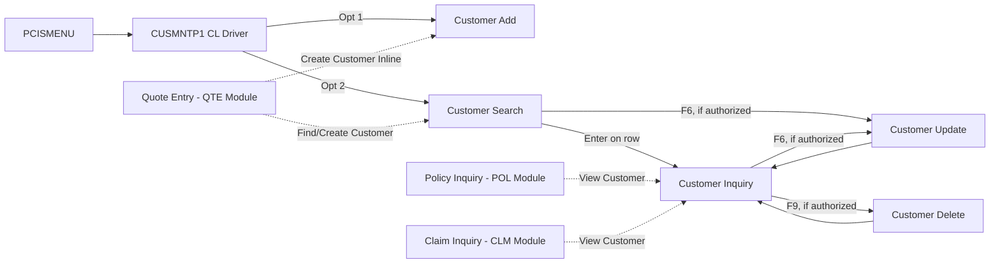

# PCIS — Customer Management Module (CUS) — Design Document

**Scope:** Design-level specification only. No COBOL/DDS/SQL source code is generated in this phase.

---

## 1. Module Overview

| Item | Value |
|---|---|
| Module Code | CUS |
| Library (Dev) | INSDEV |
| Source Files | QCBLSRC (COBOL), QDDSSRC (DDS), QSQLSRC (SQL DDL) |
| Primary Table | CUSTOMER_T (+ CUSTOMER_CONTACT_T, CUSTOMER_ADDRESS_T) |
| Programs | CUS001A, CUS002A, CUS003A, CUS004A, CUS005A |
| Driver/Menu | CUSMNTP1 (CL), invoked from PCISMENU |
| Audit Target | AUDIT_LOG_T (via AUDLOG01) |
| Dependencies | QUOTE_T, POLICY_T, CLAIM_T (referential-integrity check sources for CUS005A delete), CODE_TABLE_T (state, contact-type, address-type domains) |

### 1.1 Program Inventory

| Program | Name | Function | Type |
|---|---|---|---|
| CUS001A | Customer Add | Registers a new individual or commercial customer, with initial contact and address rows | ILE COBOL, Embedded SQL, DDS-driven |
| CUS002A | Customer Update | Maintains customer demographic/contact/address data on an existing customer | ILE COBOL, Embedded SQL, DDS-driven |
| CUS003A | Customer Inquiry | Read-only display of customer header, contacts, addresses, and cross-reference summary (quotes/policies/claims) | ILE COBOL, Embedded SQL, DDS-driven |
| CUS004A | Customer Search | Multi-criteria search (name, tax ID, phone, email, city/state) returning a subfile list of matching customers | ILE COBOL, Embedded SQL, DDS-driven |
| CUS005A | Customer Delete | Logical (and, where permitted, physical) deletion of a customer, with referential-integrity and downstream-dependency checks | ILE COBOL, Embedded SQL, DDS-driven |

### 1.2 Supporting Objects

| Object | Name | Purpose |
|---|---|---|
| Display File | CUSADDD1 | Customer Add entry panel (CUS001A) |
| Display File | CUSUPDD1 | Customer Update maintenance panel, with contact/address subfile (CUS002A) |
| Display File | CUSINQD1 | Customer Inquiry panel with subfile tabs for Contacts/Addresses/Cross-Reference (CUS003A) |
| Display File | CUSSRCD1 | Customer Search criteria + results subfile panel (CUS004A) |
| Display File | CUSDELD1 | Customer Delete confirmation panel (CUS005A) |
| Service Program | CUSVAL01 | Common customer field/business validation routines |
| Service Program | AUDLOG01 | Common audit-log writer |
| CL Driver | CUSMNTP1 | Menu entry point, mode dispatch |

---

## 2. Database Interactions

### 2.1 Core Tables Touched Per Program

| Table | CUS001A | CUS002A | CUS003A | CUS004A | CUS005A |
|---|---|---|---|---|---|
| CUSTOMER_T | INSERT | SELECT/UPDATE | SELECT | SELECT (search list) | SELECT/UPDATE (status='I') or DELETE |
| CUSTOMER_CONTACT_T | INSERT (one or more) | SELECT/INSERT/UPDATE/DELETE | SELECT | — | SELECT (dependency check) / DELETE (cascade on physical delete) |
| CUSTOMER_ADDRESS_T | INSERT (one or more) | SELECT/INSERT/UPDATE/DELETE | SELECT | — | SELECT (dependency check) / DELETE (cascade on physical delete) |
| QUOTE_T | — | — | SELECT (cross-reference count/list) | — | SELECT (block delete if rows exist) |
| POLICY_T | — | — | SELECT (cross-reference count/list) | — | SELECT (block delete if rows exist) |
| CLAIM_T | — | — | SELECT (cross-reference count/list, via POLICY_T join) | — | SELECT (block delete if rows exist) |
| CODE_TABLE_T | SELECT (state, contact-type, address-type validation lists) | SELECT (same) | — | SELECT (state filter list) | — |
| AUDIT_LOG_T | INSERT via AUDLOG01 | INSERT via AUDLOG01 | none (read-only) | none (read-only) | INSERT via AUDLOG01 |

### 2.2 Key SQL Operations by Program

**CUS001A — Customer Add**
- `SELECT` from CODE_TABLE_T (CODE_TYPE='STATE', 'CONTTYPE', 'ADDRTYPE') to populate validation lists/prompts.
- Duplicate check: `SELECT COUNT(*) FROM CUSTOMER_T WHERE TAX_ID = :HV-TAX-ID` (when TAX_ID supplied) to warn on a likely duplicate registration before insert; this is a soft warning, not a hard block, since TAX_ID is nullable and not unique-constrained at the database level (see Section 5 validation table).
- `VALUES NEXT VALUE FOR SEQ_CUSTOMER_ID` to generate CUST_ID.
- `INSERT INTO CUSTOMER_T` with CUST_STATUS defaulted to 'A' (Active), CRT_USER/CRT_TIMESTAMP set by the program.
- `INSERT INTO CUSTOMER_CONTACT_T` for each contact line entered on the panel (at least one required — see validation).
- `INSERT INTO CUSTOMER_ADDRESS_T` for each address line entered (at least one Mailing address required).
- Call `AUDLOG01` for the new CUSTOMER_T row (Action = 'A', table = CUSTOMER_T, key = CUST_ID).

**CUS002A — Customer Update**
- `SELECT` current CUSTOMER_T row by CUST_ID (with row presence/lock check before allowing edits).
- `SELECT` current CUSTOMER_CONTACT_T and CUSTOMER_ADDRESS_T rows for subfile load.
- On submit: conditional `UPDATE CUSTOMER_T` for changed header fields only (name, DOB, tax ID, email, phone, status) — UPD_USER/UPD_TIMESTAMP set on any change.
- Subfile-driven dispatch against CUSTOMER_CONTACT_T / CUSTOMER_ADDRESS_T per line action flag: `INSERT` (new line, A), `UPDATE` (changed line, C), `DELETE` (removed line, D) — same line-action pattern used by POL002A's coverage subfile.
- Optimistic concurrency: `UPDATE ... WHERE CUST_ID = :HV-CUST-ID AND UPD_TIMESTAMP = :HV-UPD-TIMESTAMP-BEFORE` (or CRT_TIMESTAMP if never previously updated) to detect a concurrent change since the row was read; a zero-rows-affected result triggers CUS0008 (record changed by another user — refresh and retry).
- Call `AUDLOG01` once per changed CUSTOMER_T field and once per contact/address line action (Full audit level).

**CUS003A — Customer Inquiry**
- `SELECT` CUSTOMER_T row by CUST_ID.
- `SELECT` all CUSTOMER_CONTACT_T rows for the customer, ordered PREFERRED_FLAG DESC, CONTACT_TYPE.
- `SELECT` all CUSTOMER_ADDRESS_T rows for the customer, ordered ADDR_TYPE.
- `SELECT COUNT(*)` and a top-N list from QUOTE_T, POLICY_T, and CLAIM_T (the latter via `CLAIM_T JOIN POLICY_T ON CLAIM_T.POL_NBR = POLICY_T.POL_NBR WHERE POLICY_T.CUST_ID = :HV-CUST-ID`) to populate the Cross-Reference tab summarizing the customer's business activity.
- No writes; read-only program, consistent with the POL003A/CLM005A precedent of no audit logging for pure inquiry.

**CUS004A — Customer Search**
- Dynamic/conditional `SELECT` against CUSTOMER_T built from whichever criteria fields the operator populates (name — `LIKE` prefix or contains match, tax ID — exact, phone/email — joined `EXISTS` against CUSTOMER_CONTACT_T, city/state — joined `EXISTS` against CUSTOMER_ADDRESS_T, status — exact).
- Results loaded into a scrollable subfile, ordered by CUST_NAME; row count capped (e.g., first 500 matches) with a "narrow your search" message if the cap is hit, to avoid an unbounded result set on a wide-open search.
- Selecting a row (Enter or a function key) passes CUST_ID to CUS003A (Inquiry) or CUS002A (Update), depending on which key was pressed and the user's authority.
- No writes; read-only program, no audit logging.

**CUS005A — Customer Delete**
- `SELECT` CUSTOMER_T row by CUST_ID for confirmation display (name, status, key demographic fields).
- Dependency check, run before any delete is permitted: `SELECT COUNT(*) FROM QUOTE_T WHERE CUST_ID = :HV-CUST-ID`, `SELECT COUNT(*) FROM POLICY_T WHERE CUST_ID = :HV-CUST-ID`, and `SELECT COUNT(*) FROM CLAIM_T JOIN POLICY_T ... WHERE POLICY_T.CUST_ID = :HV-CUST-ID`.
- If any dependency count > 0: physical delete is blocked outright (CUS0012); the program instead offers only a **logical delete** (`UPDATE CUSTOMER_T SET CUST_STATUS = 'I', UPD_USER = :HV-USER, UPD_TIMESTAMP = CURRENT_TIMESTAMP WHERE CUST_ID = :HV-CUST-ID`), which deactivates the customer for new business without destroying history.
- If no dependencies exist (a customer with no quotes, policies, or claims ever attached — e.g., entered in error): the operator may choose **physical delete**, which cascades `DELETE FROM CUSTOMER_CONTACT_T`, `DELETE FROM CUSTOMER_ADDRESS_T`, then `DELETE FROM CUSTOMER_T`, all in one committed unit.
- Call `AUDLOG01` for either the status-change (Action = 'C', field = CUST_STATUS, old/new) or the physical delete (Action = 'D', full before-image captured per the audit design in Section 4).

---

## 3. File Layouts

### 3.1 CUSTOMER_T Record Layout (primary file, used by all five programs)

| Field | Picture (COBOL host var) | SQL Type | I/O Usage |
|---|---|---|---|
| WS-CUST-ID | X(10) | VARCHAR(10) | Key — all programs |
| WS-CUST-TYPE | X(1) | CHAR(1) | I/O — CUS001A; Display — others (I=Individual, C=Commercial) |
| WS-CUST-NAME | X(60) | VARCHAR(60) | I/O — CUS001A, CUS002A; Display/Search-key — CUS003A, CUS004A |
| WS-FIRST-NAME | X(30) | VARCHAR(30) | I/O — CUS001A, CUS002A (individual only); Display — others |
| WS-LAST-NAME | X(30) | VARCHAR(30) | I/O — CUS001A, CUS002A (individual only); Display — others |
| WS-DOB | X(10) | DATE | I/O — CUS001A, CUS002A (individual only); Display — others |
| WS-TAX-ID | X(11) | VARCHAR(11) | I/O — CUS001A, CUS002A; Display — others; masked on display per Section 5 |
| WS-CUST-STATUS | X(1) | CHAR(1) | I/O — CUS001A (default 'A'), CUS002A, CUS005A (logical delete); Display — others |
| WS-EMAIL | X(60) | VARCHAR(60) | I/O — CUS001A, CUS002A; Display — others |
| WS-PHONE | X(15) | VARCHAR(15) | I/O — CUS001A, CUS002A; Display — others |
| WS-CRT-USER / WS-CRT-TIMESTAMP | X(10)/X(26) | VARCHAR(10)/TIMESTAMP | Set by program on insert |
| WS-UPD-USER / WS-UPD-TIMESTAMP | X(10)/X(26) | VARCHAR(10)/TIMESTAMP | Set by program on update; UPD-TIMESTAMP also used for optimistic lock comparison in CUS002A/CUS005A |

### 3.2 CUSTOMER_CONTACT_T Record Layout (subfile detail, CUS001A/CUS002A/CUS003A)

| Field | Picture | SQL Type |
|---|---|---|
| WS-CONTACT-ID | S9(18) COMP-3 | BIGINT |
| WS-CUST-ID | X(10) | VARCHAR(10) |
| WS-CONTACT-TYPE | X(2) | CHAR(2) (EM=Email, PH=Phone, MB=Mobile, FX=Fax) |
| WS-CONTACT-VALUE | X(60) | VARCHAR(60) |
| WS-PREFERRED-FLAG | X(1) | CHAR(1) |
| WS-LINE-ACTION (program-local, not stored) | X(1) | n/a — A/C/D flag for subfile-driven INSERT/UPDATE/DELETE dispatch in CUS002A |

### 3.3 CUSTOMER_ADDRESS_T Record Layout (subfile detail, CUS001A/CUS002A/CUS003A)

| Field | Picture | SQL Type |
|---|---|---|
| WS-ADDRESS-ID | S9(18) COMP-3 | BIGINT |
| WS-CUST-ID | X(10) | VARCHAR(10) |
| WS-ADDR-TYPE | X(1) | CHAR(1) (M=Mailing, P=Physical, B=Billing) |
| WS-ADDR-LINE1 | X(40) | VARCHAR(40) |
| WS-ADDR-LINE2 | X(40) | VARCHAR(40) |
| WS-CITY | X(30) | VARCHAR(30) |
| WS-STATE | X(2) | CHAR(2) |
| WS-ZIP | X(10) | VARCHAR(10) |
| WS-LINE-ACTION (program-local, not stored) | X(1) | n/a — A/C/D flag for subfile-driven INSERT/UPDATE/DELETE dispatch in CUS002A |

### 3.4 Cross-Reference Summary Layout (CUS003A display-only, not a stored table)

| Field | Picture | Source |
|---|---|---|
| WS-QUOTE-COUNT | S9(5) COMP-3 | `COUNT(*)` from QUOTE_T |
| WS-POLICY-COUNT | S9(5) COMP-3 | `COUNT(*)` from POLICY_T |
| WS-CLAIM-COUNT | S9(5) COMP-3 | `COUNT(*)` from CLAIM_T joined via POLICY_T |
| WS-XREF-LIST (subfile array) | — | Top-N rows per category for drill-down display |

### 3.5 Search Criteria / Results Layout (CUS004A, program-local)

| Field | Picture | Usage |
|---|---|---|
| WS-SRCH-NAME | X(60) | Optional, partial-match |
| WS-SRCH-TAX-ID | X(11) | Optional, exact match |
| WS-SRCH-PHONE | X(15) | Optional, joined match against CUSTOMER_CONTACT_T |
| WS-SRCH-EMAIL | X(60) | Optional, joined match against CUSTOMER_CONTACT_T |
| WS-SRCH-CITY | X(30) | Optional, joined match against CUSTOMER_ADDRESS_T |
| WS-SRCH-STATE | X(2) | Optional, joined match against CUSTOMER_ADDRESS_T |
| WS-SRCH-STATUS | X(1) | Optional, exact match (defaults to 'A' if left blank — see Section 5) |
| WS-RESULT-SFL (subfile array) | — | CUST_ID, CUST_NAME, CUST_TYPE, CUST_STATUS, primary city/state, primary phone |

### 3.6 Delete/Dependency-Check Layout (CUS005A, program-local)

| Field | Picture | Usage |
|---|---|---|
| WS-CUST-ID | X(10) | Key |
| WS-QUOTE-DEP-CNT | S9(5) COMP-3 | Dependency count from QUOTE_T |
| WS-POLICY-DEP-CNT | S9(5) COMP-3 | Dependency count from POLICY_T |
| WS-CLAIM-DEP-CNT | S9(5) COMP-3 | Dependency count from CLAIM_T (via POLICY_T) |
| WS-DELETE-MODE | X(1) | L=Logical (status change), P=Physical (cascade delete) — physical only enabled when all dependency counts are zero |

### 3.7 Linkage Section Parameters (Inter-Program Calls)

| Program | Parameter | Picture | Direction | Notes |
|---|---|---|---|---|
| CUS001A | LK-RETURN-CUST-ID | X(10) | Output | New customer ID for caller (e.g., QTE001A creating a customer inline during quoting) |
| CUS002A | LK-CUST-ID | X(10) | Input | From CUS003A (F6), CUS004A (search-result selection), or menu/prompt |
| CUS003A | LK-CUST-ID | X(10) | Input | From CUS004A (search-result selection), menu prompt, or cross-module navigation (Policy/Claim/Quote inquiry) |
| CUS004A | LK-RETURN-CUST-ID | X(10) | Output | Selected customer ID returned to caller for cross-navigation |
| CUS005A | LK-CUST-ID | X(10) | Input | From CUS003A (F9, authorized users only) or menu/prompt |
| All | LK-CALLING-PGM | X(10) | Input | Identifies caller for audit PROGRAM_NAME and navigation context |

---

## 4. Validation, Error Handling, and Audit Logging Design

### 4.1 Field-Level Validation (CUSVAL01 service program)

| Field | Rule | Message ID (example) |
|---|---|---|
| CUST_TYPE | Must be 'I' or 'C' | CUS0001 |
| CUST_NAME | Required, non-blank | CUS0002 |
| FIRST_NAME / LAST_NAME | Required when CUST_TYPE='I'; not applicable/cleared when CUST_TYPE='C' | CUS0003 |
| DOB | Required when CUST_TYPE='I'; must be a valid date, not in the future, and must reflect an age ≥ 16 (no underage policyholders) | CUS0004 |
| TAX_ID | If supplied, must be 9 numeric digits (SSN/EIN pattern check); format validated, not verified against an external bureau in this design | CUS0005 |
| EMAIL | If supplied, must contain '@' and a domain segment (basic pattern check, not full RFC validation) | CUS0006 |
| PHONE | If supplied, must be 10 numeric digits after stripping formatting characters | CUS0007 |
| CUST_STATUS | Must be 'A' or 'I' | CUS0009 |
| At least one CUSTOMER_CONTACT_T row | Required on Add (CUS001A); a customer with zero contact methods cannot be reached for service/billing | CUS0010 |
| At least one CUSTOMER_ADDRESS_T row of type 'M' (Mailing) | Required on Add (CUS001A) | CUS0011 |
| ADDR_TYPE | Must be 'M', 'P', or 'B' | CUS0013 |
| STATE | Must exist in CODE_TABLE_T (CODE_TYPE='STATE') | CUS0014 |
| ZIP | Must be 5 or 9 numeric digits (with optional hyphen for ZIP+4) | CUS0015 |
| CONTACT_TYPE | Must be 'EM', 'PH', 'MB', or 'FX' | CUS0016 |
| CONTACT_VALUE | Format must match CONTACT_TYPE (email pattern for 'EM', phone pattern for 'PH'/'MB'/'FX') | CUS0017 |
| Duplicate TAX_ID | Soft warning only (not a hard block) — operator must explicitly confirm intent to proceed | CUS0018 |

### 4.2 Business/Cross-Field Validation

| Rule | Applies To | Message ID |
|---|---|---|
| Concurrent update detected (UPD_TIMESTAMP mismatch) | CUS002A | CUS0008 |
| Cannot physically delete a customer with any QUOTE_T, POLICY_T, or CLAIM_T dependency | CUS005A | CUS0012 |
| Cannot set CUST_STATUS to 'I' while... (no hard block — Inactive is permitted regardless of open business, since it only blocks *new* business, not existing in-force policies/claims; this is a deliberate design choice, see Open Items) | CUS005A / CUS002A | n/a |
| Search with all criteria blank | CUS004A | CUS0019 (must supply at least one criterion to avoid an unbounded full-table scan) |
| Search result set exceeds display cap | CUS004A | CUS0020 (informational — narrow your search) |

### 4.3 Error Handling Pattern

Consistent with the POL/CLM precedent:
- All embedded SQL operations check `SQLCODE` immediately following execution.
- `SQLCODE = 100` (no rows found) on a required lookup is translated to a specific business message (e.g., "Customer not found") rather than a raw SQL error.
- `SQLCODE < 0` (any other SQL error) is trapped, logged to the job log with the failing statement context, and presented to the operator as a generic "system error — contact support" message (CUS0099) so that internal SQL detail is never exposed on a 5250 panel.
- All validation messages are loaded from a module-level message file `CUSMSGF` (IDs CUS0001–CUS0099, per the enterprise architecture's message ID convention) and displayed on the panel message line, allowing the operator to correct and resubmit without losing entered data.
- Subfile-driven maintenance (CUS002A contact/address lines) validates each changed/added line independently and positions the cursor to the first line in error, consistent with POL002A's coverage-subfile error handling.

### 4.4 Audit Logging Design

| Item | Specification |
|---|---|
| Mechanism | All mutating programs call `AUDLOG01`, the common audit-log writer used system-wide, which inserts into `AUDIT_LOG_T` via `VALUES NEXT VALUE FOR SEQ_AUDIT_LOG_ID` |
| Audit Level | Full — one row per changed field on CUSTOMER_T (capturing OLD_VALUE/NEW_VALUE), and one row per CUSTOMER_CONTACT_T/CUSTOMER_ADDRESS_T line action (Add/Change/Delete) |
| Standard Columns | AUDIT_LOG_ID, TABLE_NAME, KEY_VALUE (CUST_ID), FIELD_NAME, OLD_VALUE, NEW_VALUE, ACTION (A/C/D), PROGRAM_NAME, USER_ID, EVENT_TIMESTAMP |
| CUS001A | One audit entry for the CUSTOMER_T insert (Action='A'); one entry per contact/address row inserted |
| CUS002A | One audit entry per changed CUSTOMER_T field; one entry per contact/address line action |
| CUS003A | None — read-only |
| CUS004A | None — read-only |
| CUS005A | One audit entry for the status change (Action='C', FIELD_NAME='CUST_STATUS') on logical delete, or a full before-image set of entries (Action='D') for the CUSTOMER_T, CUSTOMER_CONTACT_T, and CUSTOMER_ADDRESS_T rows removed on physical delete |
| Retention/Inquiry | AUDIT_LOG_T rows are queried by AUD001A (Audit Inquiry, in the AUD module), not by any CUS program directly |

---

## 5. Screen Designs (DDS Panel Design — Description Only)

### 5.1 CUSADDD1 — Customer Add Panel (CUS001A)

```
 PCIS                      Customer Add                          06/20/26
 ---------------------------------------------------------------------
 Customer Type . . . . . . [_]   (I=Individual, C=Commercial)

 Customer/Business Name. . [____________________________________]
 First Name . . . . . . . . [____________________]
 Last Name  . . . . . . . . [____________________]
 Date of Birth . . . . . . [__________]
 Tax ID (SSN/EIN) . . . . . [___________]

 Email . . . . . . . . . . [______________________________]
 Phone . . . . . . . . . . [_____________]

 Mailing Address
   Line 1 . . . . . . . . . [________________________________]
   Line 2 . . . . . . . . . [________________________________]
   City . . . . . . . . . . [______________________]  State [__]  Zip [_________]

 Additional contacts/addresses may be added via the subfile below:
 Type  Value/Address                              Pref  Action
 [__]  [_______________________________________]  [_]   [_]
 [__]  [_______________________________________]  [_]   [_]
 ...

 F3=Exit  F5=Refresh  Enter=Add Customer
 Message line: [..................................................]
```

### 5.2 CUSUPDD1 — Customer Update Panel (CUS002A)

```
 PCIS                      Customer Update                       06/20/26
 ---------------------------------------------------------------------
 Customer ID . . . . . . . [__________]            Status [_] (A/I)

 Customer/Business Name. . [____________________________________]
 First Name . . . . . . . . [____________________]
 Last Name  . . . . . . . . [____________________]
 Date of Birth . . . . . . [__________]
 Tax ID (SSN/EIN) . . . . . [_________**]   (masked beyond last 4 digits)

 Email . . . . . . . . . . [______________________________]
 Phone . . . . . . . . . . [_____________]

 Contacts/Addresses Subfile (scrollable)
 Seq  Type  Value/Address                          Pref  Action(A/C/D)
 [__] [__]  [_______________________________________]  [_]  [_]
 [__] [__]  [_______________________________________]  [_]  [_]
 ...                                                           More...+

 Last Updated By: __________  on  __________________

 F3=Exit  F5=Refresh  F12=Cancel  Enter=Apply Changes
 Message line: [..................................................]
```

### 5.3 CUSINQD1 — Customer Inquiry Panel (CUS003A)

```
 PCIS                      Customer Inquiry                      06/20/26
 ---------------------------------------------------------------------
 Customer ID . . . . . . . __________   Status: _   Type: _

 Name . . . . . . . . . . . ____________________________________
 DOB. . . . . . . . . . . . __________     Tax ID: _________**

 Email. . . . . . . . . . . ______________________________
 Phone. . . . . . . . . . . _____________

 [Tab 1: Contacts]  [Tab 2: Addresses]  [Tab 3: Cross-Reference]
 ---------------------------------------------------------------------
 (Contacts tab shown by default)
 Type  Value                                        Preferred
 __    _______________________________________      _
 __    _______________________________________      _
 ...                                                        More...+

 Cross-Reference Summary (Tab 3): Quotes: ___  Policies: ___  Claims: ___

 F3=Exit  F6=Update (if authorized)  F9=Delete (if authorized)
 F19=Prev Tab  F20=Next Tab
 Message line: [..................................................]
```

### 5.4 CUSSRCD1 — Customer Search Panel (CUS004A)

```
 PCIS                      Customer Search                       06/20/26
 ---------------------------------------------------------------------
 Name (partial) . . . . . . [____________________________________]
 Tax ID (exact) . . . . . . [___________]
 Phone . . . . . . . . . . . [_____________]
 Email . . . . . . . . . . . [______________________________]
 City . . . . . . . . . . . [______________________]  State [__]
 Status . . . . . . . . . . [_]   (blank = Active only, *=All)

 F5=Search   F4=Clear Criteria

 Results:
 Cust ID    Name                              Type  Status  City/State     Phone
 ________   ________________________________   _     _      ____________   _____________
 ________   ________________________________   _     _      ____________   _____________
 ...                                                                          More...+

 F3=Exit   Enter on a row = Inquiry   F6 on a row = Update (if authorized)
 Message line: [..................................................]
```

### 5.5 CUSDELD1 — Customer Delete Confirmation Panel (CUS005A)

```
 PCIS                      Customer Delete                       06/20/26
 ---------------------------------------------------------------------
 Customer ID . . . . . . . __________
 Name . . . . . . . . . . . ____________________________________
 Status . . . . . . . . . . _

 Dependency Check:
   Quotes on file . . . . . . ___
   Policies on file . . . . . ___
   Claims on file . . . . . . ___

 [If any dependency count > 0:]
   This customer has related business records and cannot be physically
   deleted. You may deactivate the customer instead.
   Delete Mode: [L]  (L=Logical/Deactivate only)

 [If all dependency counts = 0:]
   No related business records found. Choose delete mode:
   Delete Mode: [_]  (L=Logical/Deactivate, P=Physical/Permanent Delete)

 F3=Exit (no action)   F12=Cancel   Enter=Confirm
 Message line: [..................................................]
```

---

## 6. Program-Level Specifications

### 6.1 CUS001A — Customer Add

| Item | Specification |
|---|---|
| Entry Points | Menu (CUSMNTP1 Opt 1), or called inline by another module (e.g., QTE001A) needing to register a new customer mid-transaction, returning the new CUST_ID via LK-RETURN-CUST-ID |
| Preconditions | None — this is the entity's point of origin |
| Validation Scope | Per Section 4.1/4.2 — CUST_TYPE-driven required fields, at least one contact and one mailing address, soft duplicate-TAX_ID warning |
| Key Generation | CUST_ID via SEQ_CUSTOMER_ID, formatted as a zero-padded fixed-length value per the VARCHAR(10) column definition |
| Transaction Boundary | CUSTOMER_T insert + all entered CUSTOMER_CONTACT_T rows + all entered CUSTOMER_ADDRESS_T rows commit together as a single unit — a customer is never left without at least one contact and one mailing address |
| Audit | One audit entry for the CUSTOMER_T insert (Action='A'); one entry per contact/address row inserted |
| Exit Conditions | F3 (abandon, no commit), successful completion (returns new CUST_ID to caller or displays confirmation with CUST_ID at the menu) |

### 6.2 CUS002A — Customer Update

| Item | Specification |
|---|---|
| Entry Points | Called from CUS003A (F6) or CUS004A (F6 on a search result row), or directly via menu/CUST_ID prompt |
| Preconditions | Customer must exist; CUST_STATUS may be changed freely between 'A' and 'I' from this program (in addition to the dedicated logical-delete path in CUS005A) since deactivation/reactivation is a routine maintenance action, not exclusively a deletion workflow |
| Validation Scope | Per Section 4.1/4.2 — same field rules as Add, applied to changed values only; contact/address subfile line actions validated independently per line |
| Transaction Boundary | Each submitted screen (header changes + all subfile line actions for that screen) commits together as one unit; the operator may re-display and submit again for further changes within the same call, consistent with the POL002A/CLM002A multi-action maintenance session pattern |
| Concurrency Control | Optimistic lock via UPD_TIMESTAMP (or CRT_TIMESTAMP if never updated) comparison on the CUSTOMER_T update; a stale-data condition produces CUS0008 and forces a re-read before retry |
| Audit | One audit entry per changed CUSTOMER_T field; one entry per contact/address line action (Full level) |
| Exit Conditions | F3 (return to caller/menu); F12 (cancel current unsaved changes, redisplay from database) |

### 6.3 CUS003A — Customer Inquiry

| Item | Specification |
|---|---|
| Entry Points | Menu, CUS004A (search-result selection), or cross-module navigation from Quote/Policy/Claim inquiry programs (view the customer behind a quote/policy/claim) |
| Preconditions | None — read-only, available for any existing CUST_ID regardless of status |
| Validation Scope | None beyond CUST_ID existence check |
| Data Presentation | Three logical tab views from the single panel: Contacts (default), Addresses, Cross-Reference (quote/policy/claim counts and drill-down lists) — switched via function keys, each backed by its own cursor |
| Conditional Navigation | F6 (Update) and F9 (Delete) shown/enabled only for users holding the corresponding role authority (ROLE_MENU_T check, enforced before this program is even reachable for F9, and at the panel level for the F6/F9 key-visibility itself) |
| Audit | None — non-mutating |
| Exit Conditions | F3 only (closes all open cursors first) |

### 6.4 CUS004A — Customer Search

| Item | Specification |
|---|---|
| Entry Points | Menu (CUSMNTP1 Opt 2), or cross-module navigation from any program needing to look up a customer (e.g., QTE001A's "find existing customer" step) |
| Preconditions | At least one search criterion must be supplied (CUS0019) to avoid an unbounded scan |
| Validation Scope | Criteria format validation reuses the same field-level patterns as CUS001A/CUS002A where applicable (e.g., phone digit pattern) so that an obviously malformed search value is caught before query execution |
| Result Handling | Subfile capped at a fixed maximum row count (e.g., 500); exceeding the cap displays CUS0020 prompting the operator to narrow the search rather than silently truncating without notice |
| Audit | None — read-only |
| Exit Conditions | F3 (return to caller/menu); selecting a result row navigates to CUS003A (Enter) or CUS002A (F6, if authorized) with the selected CUST_ID, or returns CUST_ID directly to a calling program via LK-RETURN-CUST-ID when CUS004A was itself invoked as a lookup sub-dialog |

### 6.5 CUS005A — Customer Delete

| Item | Specification |
|---|---|
| Entry Points | Called from CUS003A (F9, authorized users only) or directly via menu/CUST_ID prompt (role-restricted at the menu-option level) |
| Preconditions | Customer must exist; dependency check (QUOTE_T, POLICY_T, CLAIM_T) is always run first and determines which delete mode(s) are offered |
| Validation Scope | Delete Mode must be a value the dependency-check result actually permits ('L' always permitted; 'P' permitted only when all dependency counts are zero) |
| Transaction Boundary | Logical delete: single CUSTOMER_T status update. Physical delete: CUSTOMER_CONTACT_T delete + CUSTOMER_ADDRESS_T delete + CUSTOMER_T delete, all in one committed unit |
| Audit | One audit entry for the status change (logical) or a full before-image entry set across all three tables (physical) |
| Exit Conditions | F3/F12 (abandon, no action taken), Enter (confirm and execute the selected delete mode), with a final confirmation message showing what was done |

---

## 7. Cross-Program and Cross-Module Navigation Summary



---

## 8. Open Items for Build Phase

1. Confirm whether TAX_ID should carry a true uniqueness constraint at the database level (current design treats a duplicate TAX_ID as a soft warning only, consistent with the published CUSTOMER_T schema having no unique constraint on TAX_ID).
2. Confirm the exact CUST_ID format/prefix convention generated from SEQ_CUSTOMER_ID (numeric-only zero-padded vs. a module-prefixed alphanumeric key, matching whatever convention is finalized for POL_NBR/CLM_NBR).
3. Confirm the row-count cap and "narrow your search" threshold for CUS004A, and whether it should be a configurable system value (RPT_PARM_T) rather than a hard-coded constant.
4. Confirm whether CUST_STATUS='I' (Inactive) should impose any soft warning or stop when an operator attempts to create a new QUOTE_T against an inactive customer from the QTE module — this module's design assumes that check lives in QTE001A, not here.
5. Confirm masking rules for TAX_ID display (currently: last 4 digits visible, remainder masked, consistent with general PII-handling practice) and whether field-level encryption at rest is handled at the database/column level or only at the application/display layer.
6. Confirm role/menu authorization specifics for CUS005A (which ROLE_MENU_T entries gate physical vs. logical delete) — current design assumes both are gated by the same delete-capable role, but a stricter split (logical delete = standard user, physical delete = supervisor/admin only) may be required.
7. Confirm CUSTOMER_CONTACT_T/CUSTOMER_ADDRESS_T maximum row counts per customer for subfile sizing (current design assumes a small, practically-bounded number per customer with no hard-coded ceiling specified yet).

---

*This document defines the complete design for the Customer Management Module. Per instruction, no COBOL, DDS, or SQL source code has been generated — only structural design, database interaction specification, screen layouts, and program specifications. Proceed to source code generation in the next phase upon design approval.*
