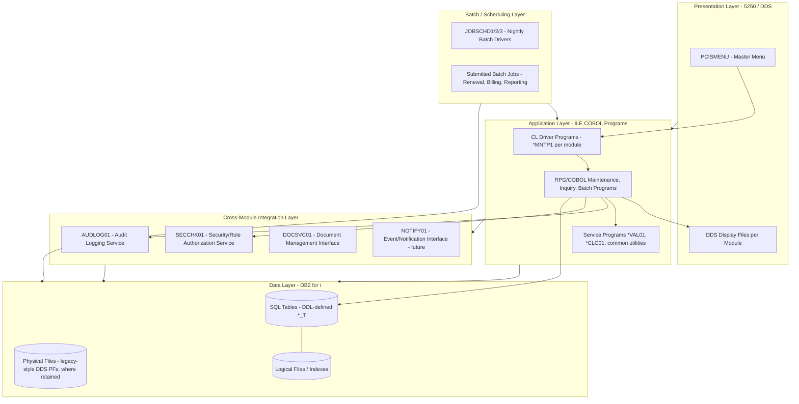
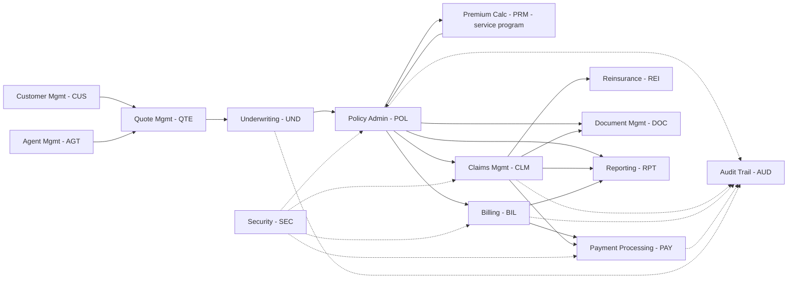
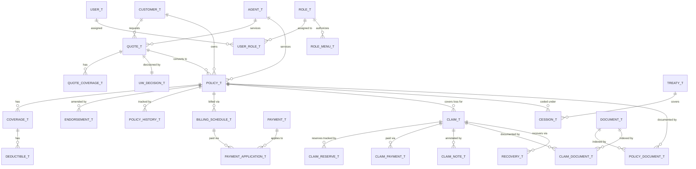
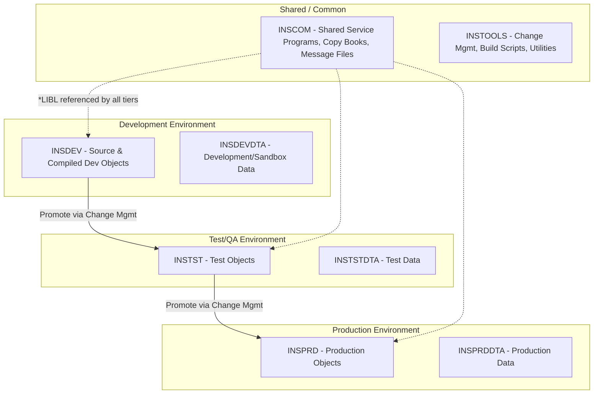
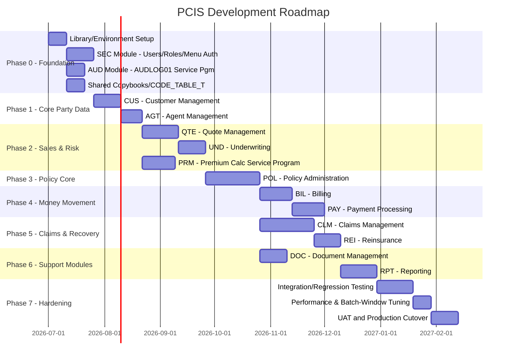

# PCIS — Property & Casualty Insurance System — Enterprise Architecture

**Platform:** IBM i (AS/400) | **Backend:** ILE COBOL + Embedded SQL / DB2 for i | **Frontend:** 5250 / DDS
**Scope:** Full enterprise architecture — system design, module breakdown, database design, naming standards, source/library structure, and development roadmap.

---

## 1. System Architecture Diagram



### 1.1 Module-to-Module Dependency Map



---

## 2. Module Breakdown

| Code | Module | Purpose | Primary Tables | Key Programs |
|---|---|---|---|---|
| CUS | Customer Management | Maintain individual/commercial customer master records | CUSTOMER_T, CUSTOMER_CONTACT_T, CUSTOMER_ADDRESS_T | CUS001A–CUS004A |
| AGT | Agent Management | Maintain producer/agent master, licensing, commission terms | AGENT_T, AGENT_LICENSE_T, AGENT_COMMISSION_T | AGT001A–AGT004A |
| QTE | Quote Management | Capture risk data, generate quotes prior to underwriting | QUOTE_T, RISK_T, VEHICLE_T, PROPERTY_T, QUOTE_COVERAGE_T | QTE001A–QTE005A |
| UND | Underwriting | Risk evaluation, referral, approve/decline decisioning | UW_DECISION_T, UW_REFERRAL_T, UW_RULE_T | UND001A–UND004A |
| POL | Policy Administration | Issue, endorse, renew, cancel, inquire on policies | POLICY_T, COVERAGE_T, DEDUCTIBLE_T, ENDORSEMENT_T, POLICY_HISTORY_T | POL001A–POL005A |
| PRM | Premium Calculation | Shared rating engine (service program, not menu-driven) | RATE_TABLE_T, RATE_FACTOR_T, PREMIUM_CALC_T | PRMCLC01 (service pgm) |
| BIL | Billing | Generate/maintain installment schedules, invoices | BILLING_SCHEDULE_T, INVOICE_T, BILLING_PLAN_T | BIL001A–BIL004A |
| PAY | Payment Processing | Receive premium payments, issue refunds/claim payments, reconcile | PAYMENT_T, REFUND_T, PAYMENT_APPLICATION_T | PAY001A–PAY005A |
| CLM | Claims Management | FNOL, adjustment, approval, payment, inquiry | CLAIM_T, CLAIM_RESERVE_T, CLAIM_PAYMENT_T, CLAIM_NOTE_T | CLM001A–CLM005A |
| REI | Reinsurance | Treaty/facultative cession tracking, recovery requests | TREATY_T, CESSION_T, RECOVERY_T | REI001A–REI004A |
| DOC | Document Management | Store/retrieve policy, claim, and correspondence documents | DOCUMENT_T, CLAIM_DOCUMENT_T, POLICY_DOCUMENT_T | DOC001A–DOC003A |
| RPT | Reporting | Operational/regulatory/management reports, extracts | RPT_PARM_T, RPT_RUN_LOG_T | RPT001A–RPT006A (mostly batch) |
| AUD | Audit Trail | Centralized change-history logging used by all modules | AUDIT_LOG_T | AUDLOG01 (service pgm), AUD001A (inquiry) |
| SEC | Security | User/role/menu-option authorization, password policy | USER_T, ROLE_T, ROLE_MENU_T, USER_ROLE_T | SEC001A–SEC004A |

### 2.1 Module Detail Summary

**CUS — Customer Management**
- CUS001A Customer Add, CUS002A Customer Maintenance, CUS003A Customer Inquiry (read-only, precedent for all *003A inquiry programs), CUS004A Customer Search/Picker (used cross-module, e.g., from POL003A).

**AGT — Agent Management**
- AGT001A Agent Add, AGT002A Agent Maintenance (status, license renewal, commission plan), AGT003A Agent Inquiry, AGT004A Agent Book-of-Business listing (policies/quotes by agent).

**QTE — Quote Management**
- QTE001A New Quote (risk capture: VEHICLE_T or PROPERTY_T depending on LOB), QTE002A Quote Maintenance (re-rate, change coverage selection), QTE003A Quote Inquiry, QTE004A Quote-to-UW Submission, QTEMNTP1 dispatch driver; QTE005A Quote-to-Policy Conversion handoff to POL001A upon UW approval.

**UND — Underwriting**
- UND001A Underwriting Review/Decision entry (Approve/Decline/Refer), UND002A Referral Queue Maintenance (supervisor review of UND-flagged risks), UND003A Underwriting Rule Maintenance (UW_RULE_T table maintenance), UND004A Underwriting Inquiry/History.

**POL — Policy Administration** *(fully detailed in POL_Module_Design_Document.md)*
- POL001A Creation, POL002A Maintenance/Endorsement, POL003A Inquiry, POL004A Renewal, POL005A Cancellation.

**PRM — Premium Calculation**
- Not a menu-driven module — a shared **service program** (`PRMCLC01`) called by QTE, POL, and batch renewal processes. Encapsulates rate-table lookup, factor application, and rounding rules so rating logic is defined exactly once.

**BIL — Billing**
- BIL001A Generate Billing Schedule (called internally by POL001A/POL004A or run standalone), BIL002A Billing Plan Maintenance (installment count/frequency change), BIL003A Invoice Generation (batch, nightly/monthly), BIL004A Billing Inquiry.

**PAY — Payment Processing**
- PAY001A Payment Entry (lockbox/teller/online capture), PAY002A Payment Application (apply cash to BILLING_SCHEDULE_T installments), PAY003A Refund Processing (consumes REFUND_T rows originated by POL005A/CLM), PAY004A NSF/Returned Payment Handling, PAY005A Payment Inquiry.

**CLM — Claims Management** *(fully detailed in CLM_Module_Design_Document.md)*
- CLM001A Registration (FNOL), CLM002A Update, CLM003A Approval, CLM004A Payment, CLM005A Inquiry.

**REI — Reinsurance**
- REI001A Treaty Maintenance, REI002A Cession Assignment (link policies/claims to a treaty), REI003A Recovery Request Processing (consumes flags raised by CLM004A), REI004A Reinsurance Inquiry/Bordereaux extract (batch-callable).

**DOC — Document Management**
- DOC001A Document Upload/Index (IFS storage + DOCUMENT_T metadata row), DOC002A Document Retrieval/View launcher, DOC003A Document Inquiry/Search (by policy, claim, customer).

**RPT — Reporting**
- Primarily batch: RPT001A Regulatory Statutory Extracts, RPT002A Management Dashboard Extracts, RPT003A Claims Loss Triangle Report, RPT004A Renewal/Retention Report, RPT005A Billing Aging Report, RPT006A Batch Exception Report (consumed by POL004A batch renewal, BIL batch billing).

**AUD — Audit Trail**
- AUDLOG01 common service program (called by every mutating program system-wide), AUD001A Audit Inquiry (search AUDIT_LOG_T by table/key/user/date range — security-restricted to audit/compliance roles).

**SEC — Security**
- SEC001A User Maintenance, SEC002A Role Maintenance, SEC003A Role-to-Menu-Option Authorization Maintenance (ROLE_MENU_T), SEC004A User Inquiry/Activity (failed logon attempts, last-signon).

---

## 3. Database Design

### 3.1 Design Conventions

- All business tables are defined as **DB2 for i SQL tables** (`CREATE TABLE`) in `QSQLSRC`, not legacy DDS physical files — DDS PFs are reserved for any externally-described files still required by older display-file conventions (none expected for new development; included for completeness/migration scenarios).
- Every table carries standard audit columns: `CRT_USER`, `CRT_TIMESTAMP`, `UPD_USER`, `UPD_TIMESTAMP`.
- Surrogate numeric keys use `BIGINT` populated via `IDENTITY`-equivalent `SEQUENCE` objects (`SEQ_xxx`), consistent with POL/CLM module precedent (`SEQ_POLICY_NBR`, `SEQ_CLAIM_NBR`, etc.).
- Status/code domains are single-character codes validated against either a dedicated lookup table or a shared generic code-table mechanism (`CODE_TABLE_T` — see 3.4) where a dedicated table is not otherwise warranted.
- Logical Files (DB2 SQL **Indexes** or DDS LFs) are created per access path, never as a substitute for normalization.

### 3.2 Master Table Inventory by Module

| Module | Core Tables |
|---|---|
| CUS | CUSTOMER_T, CUSTOMER_CONTACT_T, CUSTOMER_ADDRESS_T |
| AGT | AGENT_T, AGENT_LICENSE_T, AGENT_COMMISSION_T |
| QTE | QUOTE_T, QUOTE_COVERAGE_T, RISK_T, VEHICLE_T, PROPERTY_T |
| UND | UW_DECISION_T, UW_REFERRAL_T, UW_RULE_T |
| POL | POLICY_T, COVERAGE_T, DEDUCTIBLE_T, ENDORSEMENT_T, POLICY_HISTORY_T, POLICY_VEHICLE_T, POLICY_PROPERTY_T |
| PRM | RATE_TABLE_T, RATE_FACTOR_T, PREMIUM_CALC_T, COVERAGE_TYPE_T |
| BIL | BILLING_SCHEDULE_T, BILLING_PLAN_T, INVOICE_T |
| PAY | PAYMENT_T, PAYMENT_APPLICATION_T, REFUND_T |
| CLM | CLAIM_T, CLAIM_RESERVE_T, CLAIM_PAYMENT_T, CLAIM_NOTE_T, CLAIM_DOCUMENT_T, CLAIM_ADJUSTER_T |
| REI | TREATY_T, CESSION_T, RECOVERY_T |
| DOC | DOCUMENT_T (+ junction tables CLAIM_DOCUMENT_T, POLICY_DOCUMENT_T) |
| RPT | RPT_PARM_T, RPT_RUN_LOG_T |
| AUD | AUDIT_LOG_T |
| SEC | USER_T, ROLE_T, ROLE_MENU_T, USER_ROLE_T |
| Shared | CODE_TABLE_T, SEQUENCE objects |

### 3.3 Entity Relationship Overview (Key Tables)



### 3.4 Shared Infrastructure Tables

| Table | Purpose |
|---|---|
| CODE_TABLE_T | Generic code/description lookup (CODE_TYPE, CODE_VALUE, CODE_DESC, ACTIVE_FLAG) used for small reference domains not otherwise warranting a dedicated table (e.g., cancellation reason codes — see POL Open Item #3) |
| AUDIT_LOG_T | AUDIT_LOG_ID, TABLE_NAME, KEY_VALUE, ACTION_CD (A/C/D), FIELD_NAME, OLD_VALUE, NEW_VALUE, CHG_USER, CHG_TIMESTAMP, PROGRAM_NAME |
| RPT_PARM_T | System-value-style configurable parameters (renewal window, late-claim-reporting threshold, etc. — referenced as Open Items in POL/CLM design docs) |
| USER_T / ROLE_T / ROLE_MENU_T / USER_ROLE_T | Security model: users assigned to roles; roles authorized to specific menu options/program functions (referenced throughout POL/CLM as "ROLE_MENU_T check") |

### 3.5 Sequence Objects (Key Generation)

| Sequence | Used By | Generates |
|---|---|---|
| SEQ_CUSTOMER_ID | CUS001A | CUST_ID |
| SEQ_AGENT_ID | AGT001A | AGT_ID |
| SEQ_QUOTE_ID | QTE001A | QUOTE_ID |
| SEQ_POLICY_NBR | POL001A, POL004A | POL_NBR |
| SEQ_COVERAGE_ID | POL001A, POL002A, QTE001A | COVERAGE_ID |
| SEQ_DEDUCT_ID | POL001A, POL002A | DEDUCT_ID |
| SEQ_POL_PROP_ID / SEQ_POL_VEH_ID | POL001A | POLICY_PROPERTY_T / POLICY_VEHICLE_T keys |
| SEQ_BILL_SCHED_ID | POL001A, BIL001A | BILL_SCHED_ID |
| SEQ_CLAIM_NBR | CLM001A | CLM_NBR |
| SEQ_CLAIM_PMT_ID | CLM004A | CLM_PMT_ID |
| SEQ_PAYMENT_ID | PAY001A | PAYMENT_ID |
| SEQ_REFUND_ID | POL005A, PAY003A | REFUND_ID |
| SEQ_DOCUMENT_ID | DOC001A | DOCUMENT_ID |
| SEQ_AUDIT_LOG_ID | AUDLOG01 | AUDIT_LOG_ID |

### 3.6 Logical File / Index Strategy

Consistent with the POL/CLM precedent, every mutating or inquiry program declares its access paths explicitly rather than relying on ad hoc dynamic SQL with no supporting index:

| Pattern | Example | Rule |
|---|---|---|
| Parent-key lookup | POLICYL1 (CUST_ID), CLAIML1 (POL_NBR, LOSS_DATE) | One index per foreign-key navigation path used by an inquiry/list program |
| Composite status indexes | POLICYL2 (AGT_ID, POL_STATUS) | Used for candidate-listing batch cursors (e.g., renewal eligibility) |
| History/chronological indexes | POLHISL1 (POL_NBR, EVENT_DATE), CLMRESL1 (CLM_NBR, RESERVE_DATE) | DESC-ordered for "most recent first" subfile display |
| Module naming | `<MOD>L<n>` | Numbered sequentially per table within a module |

---

## 4. Program Naming Standards

### 4.1 Program ID Convention

```
<MODULE-CODE (3 chars)><SEQUENCE (3 digits)><TYPE-SUFFIX (1 char)>
```

| Position | Meaning | Example |
|---|---|---|
| 1–3 | Module Code | `POL`, `CLM`, `CUS`, `AGT`, `QTE`, `UND`, `BIL`, `PAY`, `REI`, `DOC`, `RPT`, `AUD`, `SEC` |
| 4–6 | Sequence number within module (001–999) | `001`, `002` |
| 7 | Type suffix: `A`=interactive/online, `B`=batch, `S`=service program, `C`=CL program | `POL001A` |

### 4.2 Standard Sequence-Number Meaning Within a Module

| Seq | Function (where applicable) |
|---|---|
| 001 | Create / Registration (FNOL for claims) |
| 002 | Maintenance / Update |
| 003 | Inquiry (read-only — always non-mutating, no audit log, per POL003A/CLM005A precedent) |
| 004 | Module-specific 4th function (Renewal for POL, Payment for CLM, etc.) |
| 005 | Module-specific 5th function (Cancellation for POL, Inquiry for CLM) |

> Modules vary in which function lands at which number (e.g., CLM005A is Inquiry, not POL's pattern) — see Section 2 module detail tables for the authoritative per-module mapping. New modules should follow the *001=Create, 002=Maintain, 003=Inquiry* convention as a baseline and append further sequence numbers for additional functions.

### 4.3 Object Naming by Type

| Object Type | Convention | Example |
|---|---|---|
| ILE COBOL Program | `<MOD><###><A/B>` | `POL001A`, `BIL003B` (batch invoice gen) |
| Service Program | `<6-char mnemonic>01` | `POLVAL01`, `PRMCLC01`, `AUDLOG01`, `CLMVAL01`, `RESCLC01`, `SECCHK01` |
| CL Driver Program | `<MOD>MNTP1` | `POLMNTP1`, `CLMMNTP1`, `BILMNTP1` |
| Display File (DDS) | `<MOD><FUNC4><n>` | `POLMNTD1`, `POLREND1`, `POLCAND1`, `CLMFNLD1`, `CLMINQD1` |
| SQL Table | `<ENTITY>_T` | `POLICY_T`, `CLAIM_T`, `AUDIT_LOG_T` |
| Junction/History Table | `<ENTITY1>_<ENTITY2>_T` or `<ENTITY>_HISTORY_T` | `POLICY_VEHICLE_T`, `POLICY_HISTORY_T` |
| Logical File / Index | `<MOD>L<n>` | `POLICYL1`, `CLMRESL1` |
| Sequence | `SEQ_<ENTITY>` | `SEQ_POLICY_NBR`, `SEQ_CLAIM_NBR` |
| CL Program (non-menu, batch job control) | `<MOD><FUNC>CL` or `JOBSCHD<n>` | `JOBSCHD2` (nightly renewal driver) |
| Copy Member (DDS-to-COBOL) | `DDS-<DSPFNAME>` | `DDS-POLMNTFM` |
| Working-Storage Host Variable | `HV-<FIELD>` | `HV-POL-NBR` |
| Screen Mirror Field | `WS-SCR-<FIELD>` | `WS-SCR-POL-STATUS` |
| Linkage Parameter | `LK-<FIELD>` | `LK-POL-NBR`, `LK-CALLING-PGM` |

### 4.4 Message File / Message ID Convention

`<MOD>####` — 4-digit sequential message ID per module (e.g., `POL0001`–`POL0099`, `CLM0001`–`CLM0099`), stored in a module-level message file `<MOD>MSGF`. This is already evidenced in the POL001A source (`POL0001`–`POL0099`) and should be applied identically across all modules.

---

## 5. Source Member Structure

### 5.1 Source File Allocation

| Source File | Member Type | Contents |
|---|---|---|
| QCBLLESRC | ILE COBOL | All `*A`, `*B`, `*S` program source |
| QDDSSRC | DDS | Display files (`*D1`), legacy physical/logical files (if any retained) |
| QSQLSRC | SQL DDL | Table, index, view, sequence, trigger definitions |
| QCLLESRC | CL (ILE) | CL driver programs, batch job-control programs |
| QCBLLESRC (copy members) | COBOL COPY | `DDS-*` record layouts generated from DDS, shared field/constant copybooks |
| QMSGF / source-controlled message text | Message File source | Module message text definitions |

### 5.2 Member Naming Inside Source Files

```
QCBLLESRC/
  POL001A      (Policy Creation)
  POL002A      (Policy Maintenance/Endorsement)
  POL003A      (Policy Inquiry)
  POL004A      (Policy Renewal)
  POL005A      (Policy Cancellation)
  POLVAL01     (Policy validation service program)
  PRMCLC01     (Premium calculation service program — shared, no module prefix lock-in)
  AUDLOG01     (Audit logging service program — shared)
  CLM001A .. CLM005A
  CLMVAL01
  RESCLC01
  ... (one block per module, per Section 2)

QDDSSRC/
  POLMNTD1     (Policy maintenance/inquiry panel)
  POLREND1     (Renewal panel)
  POLCAND1     (Cancellation panel)
  POLSCHD1     (Coverage/endorsement subfile panel)
  CLMFNLD1, CLMUPDD1, CLMAPRD1, CLMPAYD1, CLMINQD1
  ...

QSQLSRC/
  POLICY_T, COVERAGE_T, DEDUCTIBLE_T, ENDORSEMENT_T, POLICY_HISTORY_T,
  POLICY_VEHICLE_T, POLICY_PROPERTY_T   (one member per CREATE TABLE, or
                                          grouped per module as POLDDL01 — 
                                          standard: one member per table for
                                          independent change control)
  POLICYL1, POLICYL2, COVERL1, ENDTL1, POLHISL1   (index DDL)
  SEQ_POLICY_NBR, SEQ_COVERAGE_ID, ...             (sequence DDL)

QCLLESRC/
  POLMNTP1     (Policy menu/dispatch CL driver)
  CLMMNTP1
  JOBSCHD1, JOBSCHD2, JOBSCHD3   (nightly/monthly batch drivers)
```

### 5.3 Copy Member Strategy

| Copy Member | Source | Used By |
|---|---|---|
| `DDS-POLMNTFM` | Generated from DDS via `CRTCBLSRC`/H-spec record extraction | POL001A, POL002A, POL003A |
| `WS-COMMON-CONSTANTS` | Hand-maintained, QCBLLESRC copy lib | All programs — module code, standard status values |
| `SQLCA` | System-supplied (`INCLUDE SQLCA`) | Every program with embedded SQL |
| `WS-AUDLOG01-INTERFACE` | Standardized parameter block | Every mutating program calling AUDLOG01 |
| `WS-SECCHK01-INTERFACE` | Standardized parameter block | Every program performing a role/menu authorization check |

---

## 6. IBM i Library Structure



| Library | Tier | Contents |
|---|---|---|
| `INSDEV` | Development | QCBLLESRC, QDDSSRC, QSQLSRC, QCLLESRC, compiled `*PGM`/`*SRVPGM`/`*FILE` objects under active development |
| `INSDEVDTA` | Development | Development copy of DB2 tables, populated with masked/synthetic test data |
| `INSTST` | Test/QA | Promoted, compiled objects pending QA sign-off |
| `INSTSTDTA` | Test/QA | QA test data, refreshed periodically from masked production extract |
| `INSPRD` | Production | Live compiled programs, display files, service programs |
| `INSPRDDTA` | Production | Live DB2 tables — **the only library housing real customer/policy/claim data** |
| `INSCOM` | Shared/Common | Cross-module service programs (`AUDLOG01`, `SECCHK01`, `PRMCLC01`), shared copy books, message files (`POLMSGF`, `CLMMSGF`, etc.) |
| `INSTOOLS` | Tooling | Source change-management tooling, build/compile CL scripts, deployment utilities, job-scheduler (`JOBSCHD*`) objects |

### 6.1 Library List Convention (`*LIBL`) by Environment

| Environment | Library List Order |
|---|---|
| Development | `INSDEV INSDEVDTA INSCOM INSTOOLS QGPL` |
| Test/QA | `INSTST INSTSTDTA INSCOM INSTOOLS QGPL` |
| Production | `INSPRD INSPRDDTA INSCOM QGPL` |

### 6.2 Object-Level Separation Rationale

- **Objects and data are always in separate libraries** (`INSxxx` vs `INSxxxDTA`) so that a save/restore of compiled objects during promotion never touches live data, and data-only refresh cycles (e.g., refreshing `INSTSTDTA` from a production extract) never require object recompilation.
- **`INSCOM` is library-listed ahead of module-specific data but resolved at runtime via standard `*LIBL` program-call resolution** — shared service programs are compiled once and never duplicated per tier beyond the standard DEV→TST→PRD promotion path.

---

## 7. Development Roadmap

### 7.1 Phased Delivery Plan



### 7.2 Phase Detail and Rationale

| Phase | Modules | Rationale |
|---|---|---|
| **0 — Foundation** | SEC, AUD, shared infrastructure | Every other module's design (per POL/CLM precedent) calls `AUDLOG01` and performs `ROLE_MENU_T` checks; these must exist before any other program can be honestly tested |
| **1 — Core Party Data** | CUS, AGT | Both Quote and Policy depend on validated, active customer/agent records (per POL001A's own validation logic) |
| **2 — Sales & Risk** | QTE, UND, PRM | A policy is normally created by converting an approved quote (per POL001A entry-point design); PRM must exist before QTE, UND, or POL can compute any premium |
| **3 — Policy Core** | POL | The largest, most central module — five programs, full transaction-boundary and concurrency-control logic (optimistic locking pattern established here is reused by CLM002A and others) |
| **4 — Money Movement** | BIL, PAY | Depends on POLICY_T/BILLING_SCHEDULE_T being in place (originated by POL001A/POL004A/POL005A) |
| **5 — Claims & Recovery** | CLM, REI | Depends on POL (a claim cannot exist without a policy); REI depends on CLM004A's recovery-flagging interface |
| **6 — Support Modules** | DOC, RPT | DOC is an interface contract referenced by POL/CLM design docs throughout but is independently buildable once POL/CLM exist to attach documents to; RPT consumes data from essentially every prior module, so it is sequenced last among functional builds |
| **7 — Hardening** | All | End-to-end regression across the full cross-module navigation map (Section 1.1), batch-window validation for nightly renewal (POL004A) and billing runs, then UAT/cutover |

### 7.3 Cross-Cutting Workstreams (run in parallel throughout)

| Workstream | Description |
|---|---|
| Data Migration | Conversion of any legacy policy/claim/customer data into the new DB2 schema, run in parallel from Phase 1 onward with module-by-module validation |
| Change Management / Promotion Tooling | `INSTOOLS` build/compile/promotion scripts must be operational before Phase 1 work is promoted to `INSTST` |
| Code-Table & Reference Data Stewardship | `CODE_TABLE_T` domains (cancellation reasons, claim types, etc. — flagged as Open Items in both POL and CLM design docs) must be finalized with business stakeholders before the dependent module's build phase, not after |
| Security/Compliance Review | Role/menu-authorization matrix (`ROLE_MENU_T`) reviewed and signed off per module as that module reaches build, since each module's design doc references role-gated function keys (e.g., POL003A F6, CLM005A F7/F8) |

### 7.4 Known Open Design Items Carried Into Build (from POL/CLM Design Docs)

These items are explicitly flagged in the published module design documents and must be resolved during the corresponding build phase, not deferred indefinitely:

1. Renewal window parameter (POL, Phase 3) — configurable via `RPT_PARM_T`-style entry vs. hard-coded.
2. Pro-rata cancellation refund formula sign-off with Finance/Actuarial (POL, Phase 3).
3. Formal `CANCELLATION_REASON_T` or `CODE_TABLE_T` domain for POL005A (POL, Phase 3 — see Section 3.4).
4. POL002A premium-change UW-referral threshold — confirm dependency on `UW_REFERRAL_T`/UND module (POL, Phase 2/3 boundary).
5. `BILLING_SCHEDULE_T` status-domain extension (`V`=Void) — confirm with Phase 4 Billing design.
6. POL004A batch-mode commit granularity vs. nightly batch-window SLA (POL, Phase 7 performance tuning).
7. CLM adjuster auto-assignment algorithm finalization (CLM, Phase 5).
8. Mechanical linkage between CLM003A approval and CLM004A payment authority check (CLM, Phase 5) — may require a new `APPROVAL_T` table.
9. CLM late-reporting threshold configurability (CLM, Phase 5).
10. Formal payee/vendor master for 1099/tax reporting (CLM/PAY, Phase 4/5 boundary).
11. Reinsurance-cession informational flag vs. mandatory stop threshold (CLM/REI, Phase 5).
12. `CLAIM_DOCUMENT_T`/`DOCUMENT_T` IFS storage integration contract (CLM/DOC, Phase 5/6 boundary).

---

*This document defines the complete enterprise architecture for the PCIS Property & Casualty Insurance System. It is consistent with, and builds upon, the published POL and CLM module design documents. No additional COBOL/DDS/SQL source code is generated here — this is an architecture-level deliverable; detailed per-program design documents for modules other than POL and CLM should follow the same format used in `POL_Module_Design_Document.md` and `CLM_Module_Design_Document.md` before source code generation begins.*
