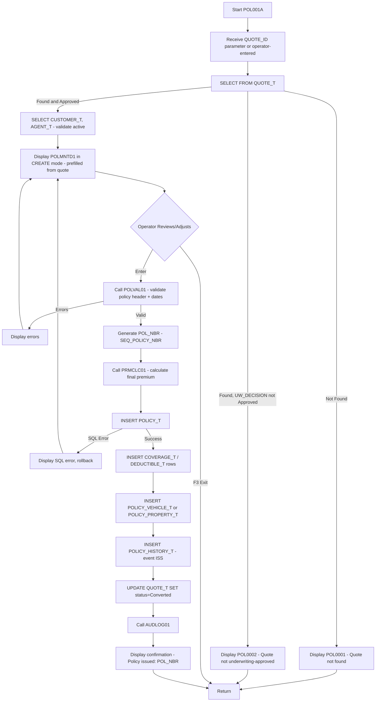
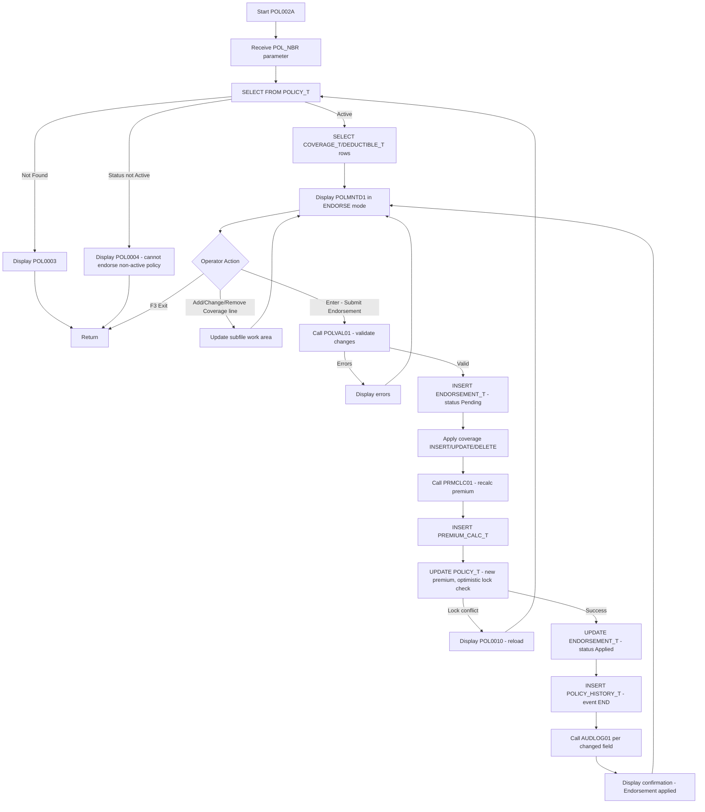
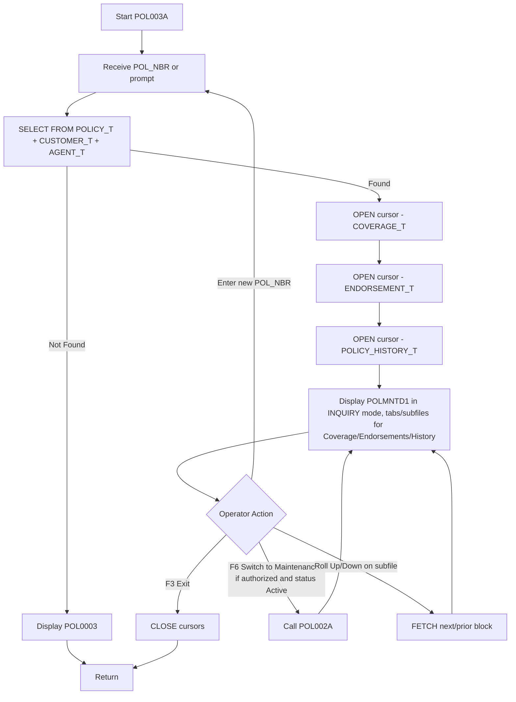
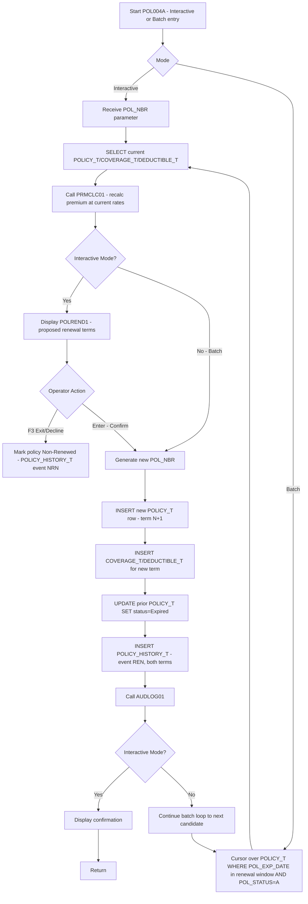
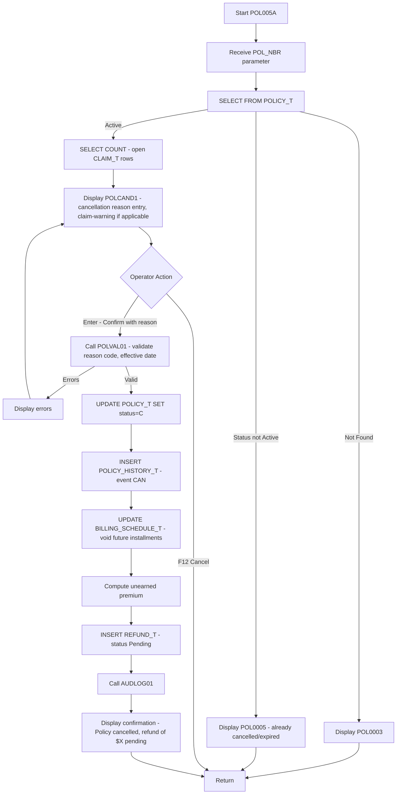
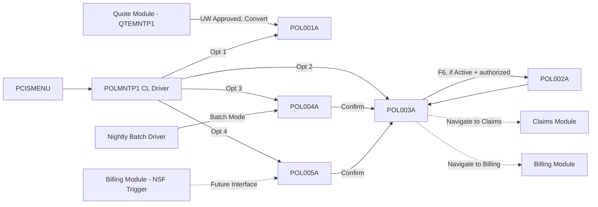

# PCIS — Policy Administration Module (POL) — Design Document

**Scope:** Design-level specification only. No COBOL/DDS/SQL source code is generated in this phase.

---

## 1. Module Overview

| Item | Value |
|---|---|
| Module Code | POL |
| Library (Dev) | INSDEV |
| Source Files | QCBLSRC (COBOL), QDDSSRC (DDS), QSQLSRC (SQL DDL) |
| Primary Table | POLICY_T (+ COVERAGE_T, DEDUCTIBLE_T, ENDORSEMENT_T, POLICY_HISTORY_T, POLICY_VEHICLE_T, POLICY_PROPERTY_T) |
| Programs | POL001A, POL002A, POL003A, POL004A, POL005A |
| Driver/Menu | POLMNTP1 (CL), invoked from PCISMENU |
| Audit Target | AUDIT_LOG_T (via AUDLOG01) |
| Dependencies | CUSTOMER_T, AGENT_T, QUOTE_T, COVERAGE_TYPE_T, RATE_TABLE_T, BILLING_SCHEDULE_T (downstream trigger) |

### 1.1 Program Inventory

| Program | Name | Function | Type |
|---|---|---|---|
| POL001A | Policy Creation | Issue a new policy, typically converting an approved quote | ILE COBOL, Embedded SQL, DDS-driven |
| POL002A | Policy Maintenance | Mid-term endorsement — change coverage/limits/address on an in-force policy | ILE COBOL, Embedded SQL, DDS-driven |
| POL003A | Policy Inquiry | Read-only display of policy, coverage, and history | ILE COBOL, Embedded SQL, DDS-driven |
| POL004A | Policy Renewal | Generate the next-term policy record at expiration | ILE COBOL, Embedded SQL, DDS-driven (interactive) / batch-callable |
| POL005A | Policy Cancellation | Terminate a policy mid-term or at non-renewal, with refund trigger | ILE COBOL, Embedded SQL, DDS-driven |

### 1.2 Supporting Objects

| Object | Name | Purpose |
|---|---|---|
| Display File | POLMNTD1 | Policy header + coverage maintenance panel (used by POL001A/POL002A/POL003A) |
| Display File | POLREND1 | Renewal confirmation/adjustment panel (POL004A) |
| Display File | POLCAND1 | Cancellation reason/confirmation panel (POL005A) |
| Display File | POLSCHD1 | Coverage/endorsement subfile panel (shared across POL001A/POL002A/POL003A) |
| Service Program | POLVAL01 | Common policy field/business validation routines |
| Service Program | PRMCLC01 | Premium calculation engine (called by POL001A, POL002A, POL004A) |
| Service Program | AUDLOG01 | Common audit-log writer |
| CL Driver | POLMNTP1 | Menu entry point, mode dispatch |

---

## 2. Database Interactions

### 2.1 Core Tables Touched Per Program

| Table | POL001A | POL002A | POL003A | POL004A | POL005A |
|---|---|---|---|---|---|
| POLICY_T | INSERT | SELECT/UPDATE | SELECT | SELECT/INSERT (new term) | SELECT/UPDATE |
| COVERAGE_T | INSERT | SELECT/INSERT/UPDATE/DELETE | SELECT | SELECT/INSERT | SELECT |
| DEDUCTIBLE_T | INSERT | SELECT/INSERT/UPDATE | SELECT | SELECT/INSERT | — |
| ENDORSEMENT_T | — | INSERT | SELECT | — | — |
| POLICY_HISTORY_T | INSERT (event=ISS) | INSERT (event=END) | SELECT | INSERT (event=REN) | INSERT (event=CAN) |
| POLICY_VEHICLE_T / POLICY_PROPERTY_T | INSERT | SELECT/INSERT/DELETE | SELECT | SELECT/INSERT | SELECT |
| CUSTOMER_T | SELECT (validate) | SELECT | SELECT | SELECT | SELECT |
| AGENT_T | SELECT (validate) | SELECT | SELECT | SELECT | SELECT |
| QUOTE_T | SELECT/UPDATE (status=Converted) | — | SELECT (origin ref) | — | — |
| RATE_TABLE_T / RATE_FACTOR_T | SELECT (via PRMCLC01) | SELECT (via PRMCLC01) | — | SELECT (via PRMCLC01) | — |
| PREMIUM_CALC_T | INSERT | INSERT | SELECT | INSERT | — |
| BILLING_SCHEDULE_T | INSERT (via downstream call/trigger to BIL module) | INSERT (premium-change installment) | SELECT | INSERT | UPDATE (cancel remaining installments) |
| REFUND_T | — | — | — | — | INSERT (trigger refund calc) |
| AUDIT_LOG_T | INSERT via AUDLOG01 | INSERT via AUDLOG01 | none (read-only) | INSERT via AUDLOG01 | INSERT via AUDLOG01 |

### 2.2 Key SQL Operations by Program

**POL001A — Policy Creation**
- `SELECT` from QUOTE_T to retrieve approved quote details (CUST_ID, AGT_ID, POL_TYPE, requested coverages) when policy originates from a quote.
- `SELECT` from CUSTOMER_T and AGENT_T to validate existence and active status of the customer and agent.
- `VALUES NEXT VALUE FOR SEQ_POLICY_NBR` (or equivalent key-generation routine) to assign POL_NBR.
- `INSERT INTO POLICY_T` with POL_STATUS initially 'A' (Active) once underwriting decision = Approved; or 'Q' if pending (rare — typically UW already resolved before policy creation per architecture).
- `INSERT INTO COVERAGE_T` and `DEDUCTIBLE_T` for each coverage line selected/confirmed.
- `INSERT INTO POLICY_VEHICLE_T` or `POLICY_PROPERTY_T` linking the risk object(s) carried over from the quote's RISK_T/VEHICLE_T/PROPERTY_T rows.
- `INSERT INTO POLICY_HISTORY_T` (EVENT_TYPE='ISS', NEW_STATUS='A').
- `UPDATE QUOTE_T SET QUOTE_STATUS = 'C'` (Converted) where QUOTE_ID matches.
- Call `AUDLOG01` for the new POLICY_T row.

**POL002A — Policy Maintenance (Endorsement)**
- `SELECT` current POLICY_T row by POL_NBR (with UPD_TIMESTAMP for optimistic locking).
- `SELECT` existing COVERAGE_T/DEDUCTIBLE_T rows for display/edit.
- On submit: `INSERT INTO ENDORSEMENT_T` capturing ENDT_TYPE, ENDT_DESC, PREM_CHANGE, ENDT_STATUS='P' initially.
- Conditional `INSERT`/`UPDATE`/`DELETE` against COVERAGE_T and DEDUCTIBLE_T per the specific change (add coverage, change limit, remove coverage).
- Call `PRMCLC01` to recompute premium impact; `INSERT INTO PREMIUM_CALC_T` with the new calculation snapshot.
- `UPDATE POLICY_T SET PREM_ANNUAL = :new-total, UPD_USER, UPD_TIMESTAMP WHERE POL_NBR = :pol-nbr AND UPD_TIMESTAMP = :original-upd-timestamp` (optimistic concurrency check).
- On successful update, `UPDATE ENDORSEMENT_T SET ENDT_STATUS = 'A'` (Applied).
- `INSERT INTO POLICY_HISTORY_T` (EVENT_TYPE='END').
- If premium changed, downstream call/trigger to Billing module to adjust BILLING_SCHEDULE_T (interface contract only — actual billing logic lives in BIL module, out of scope here).
- Call `AUDLOG01` per changed field (Full audit level, consistent with platform standard).

**POL003A — Policy Inquiry**
- `SELECT` POLICY_T joined conceptually (separate SELECTs, not a single mega-join, to keep cursors simple and host-variable mapping clean) with CUSTOMER_T and AGENT_T for display of name fields.
- `DECLARE CURSOR` / `OPEN`/`FETCH` over COVERAGE_T for the coverage subfile.
- `DECLARE CURSOR` over POLICY_HISTORY_T (ORDER BY EVENT_DATE DESC) for the history subfile.
- `DECLARE CURSOR` over ENDORSEMENT_T (ORDER BY ENDT_DATE DESC) for the endorsement subfile.
- No INSERT/UPDATE/DELETE — strictly read-only, no audit logging (consistent with CUS003A design precedent).

**POL004A — Policy Renewal**
- `SELECT` expiring POLICY_T row(s) where POL_EXP_DATE falls within the renewal processing window (interactive: a specific POL_NBR; batch: a date-range cursor for nightly renewal generation called from JOBSCHD2).
- `SELECT` current COVERAGE_T/DEDUCTIBLE_T as the renewal baseline.
- Call `PRMCLC01` to recalculate premium against current rate tables (rates may have changed since last term).
- `VALUES NEXT VALUE FOR SEQ_POLICY_NBR` for the **new** policy term number (PCIS treats each renewal term as a new POL_NBR linked conceptually via POLICY_HISTORY_T and a renewal cross-reference, rather than overwriting the prior term — preserves full historical record per regulatory retention requirements).
- `INSERT INTO POLICY_T` (new row, POL_EFF_DATE = prior POL_EXP_DATE + 1 day, POL_EXP_DATE = +1 term).
- `INSERT INTO COVERAGE_T`/`DEDUCTIBLE_T` carrying forward (or operator-adjusted) coverage selections.
- `UPDATE POLICY_T SET POL_STATUS = 'E'` (Expired) on the **prior** term's row once the new term is successfully created.
- `INSERT INTO POLICY_HISTORY_T` (EVENT_TYPE='REN') against both the old (status change to E) and new (status A) policy numbers.
- Call `AUDLOG01` for the renewal event.

**POL005A — Policy Cancellation**
- `SELECT` POLICY_T row by POL_NBR; validate POL_STATUS is currently 'A' (cannot cancel an already-cancelled or expired policy).
- `SELECT COUNT(*)` against CLAIM_T to inform the operator if open claims exist (does not block cancellation but surfaces a warning, since cancellation does not affect already-incurred claim liability).
- `UPDATE POLICY_T SET POL_STATUS = 'C', UPD_USER, UPD_TIMESTAMP WHERE POL_NBR = :pol-nbr`.
- `INSERT INTO POLICY_HISTORY_T` (EVENT_TYPE='CAN', OLD_STATUS='A', NEW_STATUS='C', REASON_CD=:operator-entered-reason).
- `UPDATE BILLING_SCHEDULE_T SET BILL_STATUS = 'V'` (Void — a status value reserved for cancellation-driven schedule voiding, extending the existing D/P/O domain) for any future-dated installments beyond the cancellation date.
- Compute unearned premium and `INSERT INTO REFUND_T` (REFUND_STATUS='P', REFUND_REASON='CAN') — actual refund issuance/check-run remains a Payment module function; POL005A only originates the refund request row.
- Call `AUDLOG01` for the cancellation event.

### 2.3 Logical Files / Indexes Used

| Object | Key | Used By |
|---|---|---|
| POLICYL1 (POLICY_T idx on CUST_ID) | CUST_ID | POL003A (policies-by-customer lookup) |
| POLICYL2 (POLICY_T idx on AGT_ID, POL_STATUS) | AGT_ID, POL_STATUS | POL003A, POL004A (renewal candidate listing) |
| COVERL1 (COVERAGE_T idx on POL_NBR) | POL_NBR | POL001A, POL002A, POL003A |
| ENDTL1 (ENDORSEMENT_T idx on POL_NBR, ENDT_DATE) | POL_NBR, ENDT_DATE | POL002A, POL003A |
| POLHISL1 (POLICY_HISTORY_T idx on POL_NBR, EVENT_DATE) | POL_NBR, EVENT_DATE | POL003A, all mutating programs (insert target) |

---

## 3. Program Flow

### 3.1 POL001A — Policy Creation



### 3.2 POL002A — Policy Maintenance (Endorsement)



### 3.3 POL003A — Policy Inquiry



### 3.4 POL004A — Policy Renewal



### 3.5 POL005A — Policy Cancellation



---

## 4. File Layouts (Program-Level View)

### 4.1 POLICY_T Record Layout (used by all five programs)

| Field | Picture (COBOL host var) | SQL Type | I/O Usage |
|---|---|---|---|
| WS-POL-NBR | X(12) | CHAR(12) | Key — all programs |
| WS-POL-TYPE | X(3) | CHAR(3) | I/O — POL001A; Display — others |
| WS-CUST-ID | X(10) | CHAR(10) | I/O — POL001A; Display — others |
| WS-AGT-ID | X(8) | CHAR(8) | I/O — POL001A, POL002A; Display — others |
| WS-QUOTE-ID | X(12) | CHAR(12) | Input — POL001A (origin link); Display — POL003A |
| WS-POL-EFF-DATE | X(10) | DATE | I/O — POL001A, POL004A; Display — others |
| WS-POL-EXP-DATE | X(10) | DATE | I/O — POL001A, POL004A; Display — others |
| WS-POL-STATUS | X(1) | CHAR(1) | I/O — all mutating programs |
| WS-PREM-ANNUAL | S9(9)V99 COMP-3 | DECIMAL(11,2) | I/O — POL001A, POL002A, POL004A; Display — POL003A |
| WS-UW-DECISION | X(1) | CHAR(1) | Display — all; set at quote stage, not editable here |
| WS-CRT-USER / WS-CRT-TIMESTAMP | X(10)/X(26) | CHAR(10)/TIMESTAMP | Set by program on insert |
| WS-UPD-USER / WS-UPD-TIMESTAMP | X(10)/X(26) | CHAR(10)/TIMESTAMP | Set by program on update; UPD-TIMESTAMP also used for optimistic lock comparison in POL002A/POL005A |

### 4.2 COVERAGE_T Record Layout (subfile detail, POL001A/POL002A/POL003A)

| Field | Picture | SQL Type |
|---|---|---|
| WS-COVERAGE-ID | X(14) | CHAR(14) |
| WS-POL-NBR | X(12) | CHAR(12) |
| WS-COV-TYPE-CD | X(5) | CHAR(5) |
| WS-COV-DESC (joined display, COVERAGE_TYPE_T) | X(60) | VARCHAR(60) |
| WS-LIMIT-AMT | S9(9)V99 COMP-3 | DECIMAL(11,2) |
| WS-PREMIUM-AMT | S9(9)V99 COMP-3 | DECIMAL(11,2) |
| WS-EFF-DATE / WS-EXP-DATE | X(10) | DATE |
| WS-LINE-ACTION (program-local, not stored) | X(1) | n/a — A/C/D flag for subfile-driven INSERT/UPDATE/DELETE dispatch in POL002A |

### 4.3 DEDUCTIBLE_T Record Layout (subfile detail)

| Field | Picture | SQL Type |
|---|---|---|
| WS-DEDUCT-ID | S9(18) COMP-3 | BIGINT |
| WS-COVERAGE-ID | X(14) | CHAR(14) |
| WS-DEDUCT-TYPE | X(1) | CHAR(1) |
| WS-DEDUCT-AMT | S9(7)V99 COMP-3 | DECIMAL(9,2) |

### 4.4 ENDORSEMENT_T Record Layout (POL002A primary, POL003A display)

| Field | Picture | SQL Type |
|---|---|---|
| WS-ENDT-ID | X(14) | CHAR(14) |
| WS-POL-NBR | X(12) | CHAR(12) |
| WS-ENDT-TYPE | X(3) | CHAR(3) |
| WS-ENDT-DATE | X(10) | DATE |
| WS-ENDT-DESC | X(100) | VARCHAR(100) |
| WS-PREM-CHANGE | S9(9)V99 COMP-3 | DECIMAL(11,2) |
| WS-ENDT-STATUS | X(1) | CHAR(1) |

### 4.5 POLICY_HISTORY_T Record Layout (write-target across all mutating programs, display in POL003A)

| Field | Picture | SQL Type |
|---|---|---|
| WS-HIST-ID | S9(18) COMP-3 | BIGINT |
| WS-POL-NBR | X(12) | CHAR(12) |
| WS-EVENT-TYPE | X(3) | CHAR(3) |
| WS-EVENT-DATE | X(10) | DATE |
| WS-OLD-STATUS / WS-NEW-STATUS | X(1) | CHAR(1) |
| WS-REASON-CD | X(5) | CHAR(5) |

### 4.6 Linkage Section Parameters (Inter-Program Calls)

| Program | Parameter | Picture | Direction | Notes |
|---|---|---|---|---|
| POL001A | LK-QUOTE-ID | X(12) | Input | From QTE module on UW-approved conversion |
| POL001A | LK-RETURN-POL-NBR | X(12) | Output | New policy number for caller (e.g., QTEMNTP1 confirmation) |
| POL002A | LK-POL-NBR | X(12) | Input | From POL003A (F6) or POL004A-driven module entry |
| POL003A | LK-POL-NBR | X(12) | Input | From menu prompt, POL002A/POL004A/POL005A return, or other module cross-reference (Claims, Billing) |
| POL004A | LK-POL-NBR | X(12) | Input | Interactive mode only; blank in batch mode (cursor-driven) |
| POL004A | LK-BATCH-MODE-FLAG | X(1) | Input | 'Y'=batch (called from JOBSCHD2), 'N'=interactive |
| POL005A | LK-POL-NBR | X(12) | Input | From POL003A or Billing/Claims-initiated cancellation request |
| All | LK-CALLING-PGM | X(10) | Input | Identifies caller for audit PROGRAM_NAME and navigation context |

---

## 5. Screen Designs (DDS Panel Design — Description Only)

### 5.1 POLMNTD1 — Policy Header / Coverage Panel (used by POL001A create mode, POL002A endorse mode, POL003A inquiry mode)

```
 PCIS                    Policy Maintenance                    06/19/26
 ---------------------------------------------------------------------
 Mode: CREATE/ENDORSE/INQUIRY              Policy Number: ____________

 Policy Type . . . . . . . [___]   (AUT, HOM, GLI, WCM)
 Customer ID . . . . . . . [__________]   Name: ________________________
 Agent ID  . . . . . . . . [________]     Name: ________________________
 Quote ID  . . . . . . . . [____________] (origin, if converted)
 Effective Date  . . . . . [__________]
 Expiration Date . . . . . [__________]
 Status  . . . . . . . . . [_]  (Q,A,E,C,R,L)
 Annual Premium  . . . . . [___________.__]
 UW Decision . . . . . . . [_]

 --- Coverage Lines (subfile) ---
 Opt  Cov Type  Description                    Limit        Premium
 _    _____     ____________________________   ___________  __________
 _    _____     ____________________________   ___________  __________
 _    _____     ____________________________   ___________  __________
       (subfile - scrollable; Opt: 1=Add 2=Change 4=Remove, ENDORSE mode only)

 ---------------------------------------------------------------------
 Msg: _________________________________________________________________
 F3=Exit  F5=Refresh  F6=Switch to Endorse  F9=History  F10=Endorsements
 F12=Cancel  Enter=Process
```

**Field-Level Mode Behavior:**
| Field | CREATE Mode | ENDORSE Mode | INQUIRY Mode |
|---|---|---|---|
| POL_NBR | Protected (system-generated post-insert) | Protected (key, display only) | Protected |
| POL_TYPE, CUST_ID, AGT_ID, dates | Input-capable | Protected (cannot change core policy identity via endorsement; separate process if ever needed) | Protected |
| Coverage subfile lines | Input-capable (initial selection) | Input-capable with Opt column active | Protected, display-only |
| Annual Premium | Display-only (computed by PRMCLC01, never directly keyed) | Display-only (recomputed after coverage change) | Display-only |
| Status | Display-only in all three modes (status transitions are driven by dedicated programs — POL004A, POL005A — not free-form entry here) | | |

### 5.2 POLREND1 — Policy Renewal Panel (used by POL004A interactive mode)

```
 PCIS                       Policy Renewal                     06/19/26
 ---------------------------------------------------------------------
 Current Policy Number . . [____________]   Expiring: __________

 Customer  . . . . . . . . ____________________________
 Agent . . . . . . . . . . ____________________________
 Current Annual Premium  . [___________.__]
 Proposed Annual Premium . [___________.__]   (recalculated at current rates)
 Premium Change  . . . . . [+/-_________.__]

 New Effective Date . . . [__________]   New Expiration Date: [__________]

 --- Coverage Lines (carried forward - subfile, editable) ---
 Opt  Cov Type  Description                    Limit        Premium
 _    _____     ____________________________   ___________  __________
       (Opt: 2=Change Limit, 4=Remove, blank=carry forward unchanged)

 ---------------------------------------------------------------------
 Msg: _________________________________________________________________
 F3=Exit/Decline to Renew  F12=Cancel  Enter=Confirm Renewal
```

### 5.3 POLCAND1 — Policy Cancellation Panel (used by POL005A)

```
 PCIS                     Policy Cancellation                  06/19/26
 ---------------------------------------------------------------------
 Policy Number . . . . . . [____________]
 Customer  . . . . . . . . ____________________________
 Current Status  . . . . . [_]
 Open Claims on Policy . . [__]   *** WARNING if > 0, see note below ***

 Cancellation Effective Date . [__________]
 Cancellation Reason Code  . . [_____]   ________________________
 Additional Notes  . . . . . . [____________________________________]

 Estimated Unearned Premium Refund: [___________.__]   (calculated on confirm)

 ---------------------------------------------------------------------
 Msg: _________________________________________________________________
 F12=Cancel/Do Not Cancel   Enter=Confirm Cancellation
```

**Design Note:** If Open Claims count > 0, panel displays a non-blocking warning message (e.g., "This policy has 2 open claim(s). Cancellation does not affect existing claim liability.") above the message line, but does not prevent the operator from proceeding — consistent with the cancellation business rule defined in Section 2.2.

---

## 6. Program Specifications

### 6.1 POL001A — Policy Creation

| Item | Specification |
|---|---|
| Entry Points | Called from QTEMNTP1 (quote-to-policy conversion) or directly from PCISMENU for manual policy entry |
| Preconditions | Quote (if used) must have UW_DECISION = 'A' (Approved); Customer and Agent must be CUST_STATUS/AGT_STATUS = 'A' |
| Key Generation | POL_NBR via SEQ_POLICY_NBR, formatted with policy-type prefix (e.g., 'AUT' + zero-padded sequence) |
| Validation Scope | Policy type code list, date range (EFF < EXP, EFF not in the past beyond a configurable grace period), customer/agent active status, at least one coverage line selected, mandatory coverages per COVERAGE_TYPE_T.MANDATORY_FLAG present |
| Premium Calculation | Delegated entirely to PRMCLC01; POL001A passes risk/coverage selections and receives back a calculated premium total and per-line premium breakdown |
| Transaction Boundary | Single logical unit of work: POLICY_T + COVERAGE_T + DEDUCTIBLE_T + POLICY_VEHICLE_T/PROPERTY_T + POLICY_HISTORY_T + QUOTE_T update all commit together; any failure rolls back the entire set |
| Audit | One audit entry for the POLICY_T insert (Action=A); coverage lines audited individually for traceability |
| Exit Conditions | F3 (abandon, no commit), successful completion (returns new POL_NBR to caller via LK-RETURN-POL-NBR) |

### 6.2 POL002A — Policy Maintenance (Endorsement)

| Item | Specification |
|---|---|
| Entry Points | Called from POL003A (F6), or directly via menu/POL_NBR prompt |
| Preconditions | POLICY_T.POL_STATUS must = 'A' (Active); cannot endorse Quoted, Expired, Cancelled, Renewed, or Lapsed policies |
| Concurrency Control | Optimistic locking via UPD_TIMESTAMP comparison; if another user updated the policy between read and submit, operator is forced to reload (POL0010) |
| Validation Scope | At least one net change required (no-op endorsements rejected), coverage limit/deductible value ranges, mandatory-coverage removal prevented, premium change reasonableness check (e.g., flag but do not block premium swings beyond a configurable percentage — routed to UW referral in a future enhancement, out of scope here) |
| Transaction Boundary | ENDORSEMENT_T insert + COVERAGE_T/DEDUCTIBLE_T changes + PREMIUM_CALC_T insert + POLICY_T update + POLICY_HISTORY_T insert all commit together |
| Audit | Field-by-field audit (Full level) comparing pre-image vs. post-image for every changed coverage/limit/premium field |
| Exit Conditions | F3 (abandon pending changes, no commit), successful completion (panel redisplays current state, ready for further endorsements in the same session) |

### 6.3 POL003A — Policy Inquiry

| Item | Specification |
|---|---|
| Entry Points | Menu, or cross-module navigation from Claims (view policy from a claim), Billing (view policy from an invoice), Customer (view policies for a customer via CUS004A-style picker) |
| Preconditions | None — read-only, available for any existing POL_NBR regardless of status (including Cancelled/Expired, for historical reference) |
| Validation Scope | None beyond POL_NBR existence check |
| Data Presentation | Three logical views accessible via function keys from the single panel: Coverage (default), Endorsement History (F10), Policy Status History (F9) |
| Audit | None — non-mutating |
| Exit Conditions | F3 only; F6 conditionally available to launch POL002A if POL_STATUS='A' and the signed-on user's role grants endorsement authority (role/menu check via ROLE_MENU_T) |

### 6.4 POL004A — Policy Renewal

| Item | Specification |
|---|---|
| Entry Points | Interactive: menu/POL_NBR prompt for a single policy nearing expiration. Batch: called from JOBSCHD2 (nightly renewal driver) with a date-range cursor across all eligible policies |
| Preconditions | POL_STATUS = 'A'; POL_EXP_DATE within the renewal window (e.g., 30/60/90 days out, per configurable parameter — exact window finalized at build time) |
| Premium Recalculation | Mandatory call to PRMCLC01 against current RATE_TABLE_T/RATE_FACTOR_T values, since rates may have changed since the prior term was rated |
| Term Continuity Model | New POL_NBR generated per term (no overwrite of prior-term row); prior term's status set to 'E' (Expired) only upon successful creation of the new term, preserving an unbroken historical chain navigable via POLICY_HISTORY_T |
| Validation Scope | Coverage carry-forward integrity (no orphaned coverage references), interactive-mode decline path (operator may decline renewal, which logs a Non-Renewal history event rather than creating a new term) |
| Transaction Boundary | New POLICY_T + COVERAGE_T + DEDUCTIBLE_T insert, prior POLICY_T status update, and dual POLICY_HISTORY_T inserts (old term + new term) commit together per policy processed |
| Batch Considerations | Batch mode processes one policy per commit cycle (not one giant transaction for the whole run) so a single failure does not block the remaining renewal population; failures are logged and surfaced via a batch exception report (Reporting module, out of scope here) rather than interactive error display |
| Audit | One audit entry per renewal event, referencing both old and new POL_NBR in the key/value or field-name context |
| Exit Conditions | Interactive: F3 (decline), successful confirmation. Batch: loop continues to next candidate regardless of individual outcome |

### 6.5 POL005A — Policy Cancellation

| Item | Specification |
|---|---|
| Entry Points | Menu/POL_NBR prompt, or cross-module trigger (e.g., non-payment cancellation initiated by the Billing module — interface contract only, actual NSF-driven trigger logic lives in BIL module) |
| Preconditions | POL_STATUS = 'A' (cannot cancel a policy that is not currently active) |
| Validation Scope | Cancellation effective date must be ≥ POL_EFF_DATE and ≤ current date (no future-dated cancellations in this design — flagged as an open item if backdating/future-dating business need is identified later), reason code must exist in a cancellation-reason code table (new reference table, to be added to the database design in a future iteration if not already covered generically by a shared code-table mechanism) |
| Refund Calculation | Pro-rata unearned premium computed as a function of PREM_ANNUAL, POL_EFF_DATE, POL_EXP_DATE, and the cancellation effective date; exact formula finalized with Finance/Actuarial sign-off at build time — placeholder design assumes straight-line daily proration |
| Transaction Boundary | POLICY_T status update + POLICY_HISTORY_T insert + BILLING_SCHEDULE_T void update(s) + REFUND_T insert all commit together |
| Audit | One audit entry for the status change (Action=C, OLD_VALUE='A', NEW_VALUE='C' on CUST_STATUS-equivalent field CUST_STATUS→here POL_STATUS) plus one for the REFUND_T insert |
| Exit Conditions | F12 (abandon, no commit), successful confirmation showing the computed refund amount queued for Payment module processing |

---

## 7. Cross-Program and Cross-Module Navigation Summary



---

## 8. Open Items for Build Phase

1. Confirm renewal window parameter (30/60/90 days) and whether it should be a configurable system value (`RPT_PARM_T`-style entry) versus hard-coded in POL004A/JOBSCHD2.
2. Confirm exact pro-rata refund formula with Finance/Actuarial before building POL005A's calculation logic — current design assumes simple straight-line daily proration with no short-rate cancellation penalty; flag if short-rate tables apply per state regulation.
3. Add a CANCELLATION_REASON_T (or extend an existing generic code-table mechanism) to formalize the reason-code domain referenced in POL005A validation — not yet present in the published database design.
4. Confirm whether POL002A premium-change percentage threshold should trigger a mandatory UW referral (would introduce a new dependency on the UW_REFERRAL_T table and UND module) or remain a future enhancement.
5. Confirm BILLING_SCHEDULE_T status domain extension (adding 'V'=Void) is acceptable, or whether cancellation-driven schedule changes should instead be a physical delete of future-dated rows — recommend status-flag approach for audit-trail completeness.
6. Confirm POL004A batch-mode commit granularity (per-policy, as currently designed) against the nightly batch window SLA — large renewal populations may need controlled commit-interval batching (e.g., commit every N policies) rather than strictly one-at-a-time, to balance journal/lock overhead.

---

*This document defines the complete design for the Policy Administration Module. Per instruction, no COBOL, DDS, or SQL source code has been generated — only structural design, database interaction specification, screen layouts, and program specifications. Proceed to source code generation in the next phase upon design approval.*
