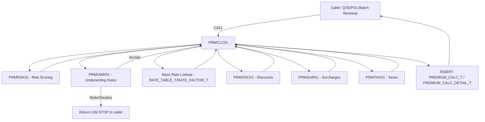

# PCIS — Premium Calculation Engine (PRM) — Design Document

**Scope:** Design-level specification, rating algorithms, and ILE COBOL program structure for the shared Premium Calculation service program suite. No production-complete source code is generated in this phase — structure, paragraph map, and linkage contracts only, consistent with the build-sequencing pattern used for POL and CLM.

---

## 1. Module Overview

| Item | Value |
|---|---|
| Module Code | PRM |
| Library (Dev) | INSDEV |
| Source Files | QCBLSRC (COBOL), QSQLSRC (SQL DDL) |
| Nature | Shared **service program suite** — not menu-driven, no display files |
| Primary Tables (read) | RATE_TABLE_T, RATE_FACTOR_T, RISK_SCORE_FACTOR_T*, UW_RULE_T, DISCOUNT_RULE_T*, SURCHARGE_RULE_T*, TAX_TABLE_T* |
| Primary Tables (write) | PREMIUM_CALC_T, PREMIUM_CALC_DETAIL_T*, UW_REFERRAL_T |
| Callers | QTE001A/QTE002A (quoting), POL001A/POL002A/POL004A (policy), batch renewal (POL004A-BATCH), UND001A (re-rate on referral resolution) |
| Entry Program | PRMCLC01 (orchestrator — the single public entry point all callers use) |
| Internal Service Programs | PRMRSK01 (risk scoring), PRMUWR01 (underwriting rule evaluation), PRMDSC01 (discount engine), PRMSUR01 (surcharge engine), PRMTAX01 (tax engine) |

\* Tables marked with an asterisk are new tables required by this design and not yet present in `PCIS_Database_Design.md`; see Section 8, Open Items.

### 1.1 Why a Multi-Program Suite Instead of One Monolith

`PRMCLC01` remains the **only program any caller ever CALLs** — this preserves the existing contract already embedded in POL001A/POL002A/POL004A and the QTE module. Internally, PRMCLC01 delegates to five focused internal service programs so that:
- Risk scoring (actuarial logic) can change without touching tax logic (regulatory logic), and vice versa.
- Each engine has an independently testable, narrow LINKAGE SECTION contract.
- Underwriting rule evaluation (which can **stop** the rating process with a Refer/Decline) is cleanly separated from pure arithmetic engines (discounts/surcharges/taxes), which never stop the process, only adjust amounts.



---

## 2. Rating Pipeline — End-to-End Sequence

The engine always executes in this fixed order. Order matters: risk score must exist before underwriting rules evaluate it; underwriting must clear before money is calculated; discounts apply to base premium before surcharges; taxes apply last, to the post-discount/post-surcharge subtotal (matching standard P&C statutory practice).

1. **Risk Score Calculation** — composite score from Property Risk + Vehicle Risk + Customer Risk sub-scores (whichever apply to the LOB).
2. **Underwriting Rules** — evaluate composite score and individual hard-stop conditions against `UW_RULE_T`. Outcome: Accept (continue), Refer (continue rating but flag), or Decline (stop, no premium produced).
3. **Base Rate / Rating Factor Lookup** — existing logic (territory, coverage type, limit) already implemented in PRMCLC01 today, retained as Step 3.
4. **Discounts** — apply all qualifying multiplicative/additive discounts to the base+factor premium.
5. **Surcharges** — apply all qualifying surcharges to the post-discount amount.
6. **Taxes** — apply state/municipal premium tax and any policy fees to the post-surcharge amount, producing the final premium.
7. **Persist** — write `PREMIUM_CALC_T` (summary) and `PREMIUM_CALC_DETAIL_T` (every factor, discount, surcharge, and tax line, for auditability and rate-disclosure compliance) and return the final premium plus a full breakdown to the caller.

---

## 3. Risk Score Calculation (Requirement 1)

### 3.1 Design

A single **composite risk score**, `WS-COMPOSITE-RISK-SCORE` (numeric, 3 decimal positions, conceptually 0.000–100.000, where higher = riskier), is computed as a weighted blend of up to three sub-scores depending on line of business:

| LOB | Sub-scores used | Weighting |
|---|---|---|
| HOM/CML (Property) | Property Risk + Customer Risk | 70% / 30% |
| AUT (Vehicle) | Vehicle Risk + Customer Risk | 65% / 35% |
| Any LOB with multiple risk objects (e.g., commercial package) | Property + Vehicle + Customer | 45% / 30% / 25% |

Weights are not hardcoded as literals in COBOL — they are stored in `RISK_SCORE_FACTOR_T` keyed by `POL_TYPE` and `FACTOR_TYPE = 'WEIGHT-PROP'/'WEIGHT-VEH'/'WEIGHT-CUST'`, so actuarial staff can recalibrate without a program change.

### 3.2 Algorithm — `4000-CALCULATE-COMPOSITE-RISK-SCORE` (in PRMRSK01)

```
INPUT:  POL-TYPE, PROP-RISK-DATA (optional), VEH-RISK-DATA (optional),
        CUST-RISK-DATA
OUTPUT: COMPOSITE-RISK-SCORE, RISK-TIER (A/B/C/D/F)

1. ZERO composite-score, weight-total
2. IF property risk object present
     CALL 4100-CALCULATE-PROPERTY-RISK-SCORE  -> prop-score
     LOOKUP weight-prop FROM RISK_SCORE_FACTOR_T
     ADD (prop-score * weight-prop) TO composite-score
     ADD weight-prop TO weight-total
3. IF vehicle risk object(s) present
     FOR EACH vehicle ON the risk
       CALL 4200-CALCULATE-VEHICLE-RISK-SCORE -> veh-score(i)
     END-FOR
     veh-score = AVERAGE of veh-score(i)  [fleet-style averaging]
     LOOKUP weight-veh FROM RISK_SCORE_FACTOR_T
     ADD (veh-score * weight-veh) TO composite-score
     ADD weight-veh TO weight-total
4. CALL 4300-CALCULATE-CUSTOMER-RISK-SCORE -> cust-score
     LOOKUP weight-cust FROM RISK_SCORE_FACTOR_T
     ADD (cust-score * weight-cust) TO composite-score
     ADD weight-cust TO weight-total
5. IF weight-total NOT = 100 (defensive — config drift)
     NORMALIZE: composite-score = composite-score * (100 / weight-total)
6. ROUND composite-score TO 3 decimal places (ROUNDED phrase, half-up)
7. EVALUATE composite-score
     WHEN <= 20.000   MOVE 'A' TO risk-tier   (best)
     WHEN <= 40.000   MOVE 'B' TO risk-tier
     WHEN <= 60.000   MOVE 'C' TO risk-tier
     WHEN <= 80.000   MOVE 'D' TO risk-tier
     WHEN OTHER       MOVE 'F' TO risk-tier   (worst)
   END-EVALUATE
8. RETURN composite-score, risk-tier
```

RISK-TIER drives the rating-factor lookup (`RATE_FACTOR_T.FACTOR_TYPE = 'RISK-TIER'`) and is also the primary input to Underwriting Rules (Section 6).

---

## 4. Property Risk (Requirement 2)

### 4.1 Inputs (from `PROPERTY_T` / `PROPERTY_FEATURE_T`, supplied by caller via LINKAGE)

| Field | Source | Risk Direction |
|---|---|---|
| YEAR_BUILT | PROPERTY_T | Older = riskier (age bands) |
| CONSTRUCTION_TYPE | PROPERTY_T | Frame > Masonry > Fire-Resistive (riskiest to safest) |
| ROOF_AGE / ROOF_TYPE | PROPERTY_FEATURE_T | Older/composite shingle riskier than newer/metal/tile |
| SQ_FOOTAGE vs REPLACEMENT_VALUE | PROPERTY_T | Replacement value per sq ft outside normal range flags valuation risk |
| PROTECTION_CLASS (fire district rating) | PROPERTY_FEATURE_T | Higher protection class number = farther from fire dept = riskier |
| PRIOR_LOSS_COUNT (3-yr property loss history) | PROPERTY_T / claims history join | More prior losses = riskier |
| SECURITY_FEATURES (alarm, sprinkler) | PROPERTY_FEATURE_T | Presence reduces risk |
| TERRITORY_CD (via RISK_T) | RISK_T | Catastrophe/crime exposure by territory |

### 4.2 Algorithm — `4100-CALCULATE-PROPERTY-RISK-SCORE` (in PRMRSK01)

```
INPUT:  PROP-RISK-DATA (year-built, construction-type, roof-age, roof-type,
        sq-footage, replacement-value, protection-class, prior-loss-count,
        security-flags, territory-cd)
OUTPUT: PROP-RISK-SCORE (0-100)

1. base-score = 50  (neutral starting point)

2. -- Age of structure
   age = CURRENT-YEAR - year-built
   EVALUATE TRUE
     WHEN age <= 10              SUBTRACT 10 FROM base-score
     WHEN age <= 25              SUBTRACT 3  FROM base-score
     WHEN age <= 50              ADD      5  TO   base-score
     WHEN OTHER (>50)            ADD      15 TO   base-score
   END-EVALUATE

3. -- Construction type (lookup multiplier table, additive points)
   LOOKUP construction-points FROM RISK_SCORE_FACTOR_T
          WHERE FACTOR_TYPE = 'CONSTR' AND FACTOR_VALUE_CD = construction-type
   ADD construction-points TO base-score

4. -- Roof condition
   IF roof-age > 20                    ADD 8  TO base-score
   IF roof-type = 'WOOD-SHAKE'         ADD 10 TO base-score
   IF roof-type = 'METAL' OR 'TILE'    SUBTRACT 5 FROM base-score

5. -- Valuation consistency check
   value-per-sqft = replacement-value / sq-footage
   LOOKUP expected-range FROM RISK_SCORE_FACTOR_T per territory/constr-type
   IF value-per-sqft OUTSIDE expected-range (+/- 25%)
       ADD 5 TO base-score   (under/over-insurance risk)

6. -- Protection class (1=best/closest to fire dept, 10=worst)
   ADD (protection-class * 2) TO base-score

7. -- Prior loss history
   ADD (prior-loss-count * 7) TO base-score, CAP contribution at 21

8. -- Protective devices (reduce score)
   IF has-sprinkler-flag = 'Y'    SUBTRACT 8  FROM base-score
   IF has-monitored-alarm = 'Y'   SUBTRACT 5  FROM base-score

9. -- Territory catastrophe loading
   LOOKUP cat-loading FROM RISK_SCORE_FACTOR_T
          WHERE FACTOR_TYPE = 'TERR-CAT' AND FACTOR_VALUE_CD = territory-cd
   ADD cat-loading TO base-score

10. CLAMP base-score TO RANGE 0 - 100  (floor/ceiling)
11. RETURN base-score AS prop-risk-score
```

---

## 5. Vehicle Risk (Requirement 3)

### 5.1 Inputs (from `VEHICLE_T` / `VEHICLE_FEATURE_T`)

| Field | Risk Direction |
|---|---|
| VEHICLE_AGE (model year vs current year) | Newer = more expensive to repair (physical damage), older = more mechanical-failure liability risk; non-linear, table-driven |
| VEHICLE_TYPE / BODY_STYLE | Sports/performance riskier than sedan/minivan |
| ANNUAL_MILEAGE | Higher mileage = higher exposure |
| USE_TYPE (Pleasure/Commute/Business) | Business/commute riskier than pleasure |
| SAFETY_FEATURES (ABS, airbags, lane-assist, automatic braking) | Presence reduces risk |
| ANTI_THEFT_DEVICE | Presence reduces comprehensive risk |
| PRIOR_CLAIM_COUNT (vehicle-specific, 3-yr) | More prior claims = riskier |
| TERRITORY_CD | Urban/high-theft territories riskier |

### 5.2 Algorithm — `4200-CALCULATE-VEHICLE-RISK-SCORE` (in PRMRSK01)

```
INPUT:  VEH-RISK-DATA (vehicle-age, vehicle-type, annual-mileage, use-type,
        safety-feature-flags, anti-theft-flag, prior-claim-count,
        territory-cd)
OUTPUT: VEH-RISK-SCORE (0-100)

1. base-score = 50

2. -- Vehicle type / body style (table lookup, additive points)
   LOOKUP type-points FROM RISK_SCORE_FACTOR_T
          WHERE FACTOR_TYPE = 'VEH-TYPE' AND FACTOR_VALUE_CD = vehicle-type
   ADD type-points TO base-score

3. -- Vehicle age (non-linear: very new = high physical-damage cost exposure,
   --                very old = mechanical/safety risk)
   EVALUATE TRUE
     WHEN vehicle-age <= 2          ADD 8  TO base-score
     WHEN vehicle-age <= 7          SUBTRACT 5 FROM base-score
     WHEN vehicle-age <= 12         ADD 3  TO base-score
     WHEN OTHER (>12)               ADD 12 TO base-score
   END-EVALUATE

4. -- Mileage exposure
   EVALUATE TRUE
     WHEN annual-mileage <  7,500   SUBTRACT 6 FROM base-score
     WHEN annual-mileage < 12,000   no change
     WHEN annual-mileage < 18,000   ADD 6  TO base-score
     WHEN OTHER                     ADD 12 TO base-score
   END-EVALUATE

5. -- Use type
   EVALUATE use-type
     WHEN 'PLEASURE'   SUBTRACT 5 FROM base-score
     WHEN 'COMMUTE'    no change
     WHEN 'BUSINESS'   ADD 10 TO base-score
   END-EVALUATE

6. -- Safety features (each present reduces score, capped)
   safety-credit = COUNT of TRUE flags among
                   (ABS, airbags, lane-assist, auto-brake) * 2
   CAP safety-credit AT 8
   SUBTRACT safety-credit FROM base-score

7. -- Anti-theft device
   IF anti-theft-flag = 'Y'   SUBTRACT 4 FROM base-score

8. -- Prior claims (vehicle-specific)
   ADD (prior-claim-count * 9) TO base-score, CAP contribution at 27

9. -- Territory loading (theft/accident-frequency territory factor)
   LOOKUP terr-points FROM RISK_SCORE_FACTOR_T
          WHERE FACTOR_TYPE = 'TERR-AUTO' AND FACTOR_VALUE_CD = territory-cd
   ADD terr-points TO base-score

10. CLAMP base-score TO RANGE 0 - 100
11. RETURN base-score AS veh-risk-score
```

When multiple vehicles are on one policy, `4000-CALCULATE-COMPOSITE-RISK-SCORE` averages the per-vehicle scores (Section 3.2, Step 3) rather than calling this paragraph multiple times independently of the composite logic — this keeps fleet-style policies from being penalized purely for vehicle count.

---

## 6. Customer Risk (Requirement 4)

### 6.1 Inputs (from `CUSTOMER_T` and supporting history)

| Field | Risk Direction |
|---|---|
| CUSTOMER_TYPE (Individual/Commercial) | Different scoring tables entirely |
| CREDIT_TIER (where state law permits insurance credit scoring) | Lower tier = riskier; **must be skipped entirely in states where prohibited** (CA, MA, HI, MD — configurable via `STATE_RULE_T`/state flag) |
| YEARS_AT_CURRENT_ADDRESS | Shorter tenure = slightly higher risk (stability proxy) |
| PRIOR_POLICY_CANCEL_COUNT (non-pay or UW-initiated, any LOB, 5-yr) | More cancellations = riskier |
| CLAIM_FREQUENCY (3-yr, any LOB) | More claims = riskier |
| CUSTOMER_TENURE_YEARS (loyalty, existing book) | Longer tenure = lower risk (also feeds Discounts, Section 7) |
| OCCUPATION_RISK_CLASS (commercial customers — industry classification) | High-hazard industries riskier |

### 6.2 Algorithm — `4300-CALCULATE-CUSTOMER-RISK-SCORE` (in PRMRSK01)

```
INPUT:  CUST-RISK-DATA (customer-type, credit-tier, years-at-address,
        prior-cancel-count, claim-frequency-3yr, tenure-years,
        occupation-risk-class, state-cd)
OUTPUT: CUST-RISK-SCORE (0-100)

1. base-score = 50

2. -- Credit-based insurance score (jurisdiction-gated)
   CALL 9500-CHECK-CREDIT-SCORING-ALLOWED USING state-cd
        RETURNING credit-allowed-flag
   IF credit-allowed-flag = 'Y'
       LOOKUP credit-points FROM RISK_SCORE_FACTOR_T
              WHERE FACTOR_TYPE = 'CREDIT-TIER' AND FACTOR_VALUE_CD = credit-tier
       ADD credit-points TO base-score
   ELSE
       -- redistribute credit's weight to claim-frequency and tenure
       -- per a state-specific alternate-factor table (regulatory requirement)
       PERFORM 9510-APPLY-ALTERNATE-CUSTOMER-FACTORS
   END-IF

3. -- Address/residential stability
   EVALUATE TRUE
     WHEN years-at-address >= 5     SUBTRACT 4 FROM base-score
     WHEN years-at-address >= 2     no change
     WHEN OTHER                     ADD 4  TO base-score
   END-EVALUATE

4. -- Prior cancellations
   ADD (prior-cancel-count * 10) TO base-score, CAP contribution at 30

5. -- Claim frequency (any LOB, 3-yr)
   ADD (claim-frequency-3yr * 8) TO base-score, CAP contribution at 24

6. -- Tenure with PCIS (loyalty reduces perceived risk slightly)
   IF tenure-years >= 5   SUBTRACT 5 FROM base-score
   ELSE IF tenure-years >= 1  SUBTRACT 2 FROM base-score

7. -- Commercial occupation/industry risk class (commercial customers only)
   IF customer-type = 'C'
       LOOKUP occ-points FROM RISK_SCORE_FACTOR_T
              WHERE FACTOR_TYPE = 'OCC-CLASS'
                AND FACTOR_VALUE_CD = occupation-risk-class
       ADD occ-points TO base-score
   END-IF

8. CLAMP base-score TO RANGE 0 - 100
9. RETURN base-score AS cust-risk-score
```

---

## 7. Underwriting Rules (Requirement 5)

### 7.1 Design

`PRMUWR01` evaluates the composite risk score and a set of **hard-stop conditions** against `UW_RULE_T` rows for the policy type, in priority order. Each rule row carries: `RULE_TYPE` (THRESHOLD / HARD-STOP), `RULE_CONDITION` (field + operator + value, e.g. `PRIOR-CANCEL-COUNT > 3`), `RULE_ACTION` (ACCEPT/REFER/DECLINE), `RULE_PRIORITY` (lower number evaluates first), and `RULE_REASON_TEXT`.

This mirrors the existing `UW_RULE_T` / UND module design — PRMUWR01 does not replace UND001A's manual underwriter review; it performs the **automated first pass** that determines whether rating can proceed straight through (Accept), must be calculated but flagged for human review (Refer — premium still computed and returned, but `UW_REFERRAL_T` row is written and caller is told to route to UND002A queue), or must stop immediately (Decline — no premium computed, caller receives UW-STOP and a reason).

### 7.2 Algorithm — `5000-EVALUATE-UNDERWRITING-RULES` (in PRMUWR01)

```
INPUT:  POL-TYPE, COMPOSITE-RISK-SCORE, RISK-TIER, HARD-STOP-DATA
        (e.g., prior-cancel-count, claim-frequency-3yr, occupation-risk-class,
         construction-type, vehicle-type, customer-type)
OUTPUT: UW-DECISION (ACCEPT/REFER/DECLINE), UW-REASON-TEXT,
        UW-RULE-ID-MATCHED

1. MOVE 'ACCEPT' TO uw-decision   (default — innocent until a rule fires)
2. DECLARE CURSOR UWRULE-CSR FOR
     SELECT RULE_ID, RULE_TYPE, RULE_CONDITION, RULE_ACTION,
            RULE_REASON_TEXT
       FROM UW_RULE_T
      WHERE POL_TYPE = :pol-type AND RULE_STATUS = 'A'
      ORDER BY RULE_PRIORITY
3. OPEN UWRULE-CSR
4. PERFORM UNTIL end-of-cursor
     FETCH UWRULE-CSR INTO rule-id, rule-type, rule-condition,
                            rule-action, rule-reason-text
     IF NOT end-of-cursor
         EVALUATE rule-type
           WHEN 'THRESHOLD'
             -- rule-condition references COMPOSITE-RISK-SCORE or RISK-TIER
             IF 6100-EVALUATE-CONDITION(rule-condition, composite-risk-score,
                                         risk-tier) = TRUE
                 MOVE rule-action      TO uw-decision
                 MOVE rule-reason-text TO uw-reason-text
                 MOVE rule-id          TO uw-rule-id-matched
                 IF uw-decision = 'DECLINE'
                     EXIT PERFORM   (most severe outcome — stop immediately)
                 END-IF
             END-IF
           WHEN 'HARD-STOP'
             -- rule-condition references a specific HARD-STOP-DATA field
             IF 6100-EVALUATE-CONDITION(rule-condition, hard-stop-data) = TRUE
                 MOVE rule-action      TO uw-decision
                 MOVE rule-reason-text TO uw-reason-text
                 MOVE rule-id          TO uw-rule-id-matched
                 IF uw-decision = 'DECLINE'
                     EXIT PERFORM
                 END-IF
             END-IF
         END-EVALUATE
     END-IF
   END-PERFORM
5. CLOSE UWRULE-CSR
6. IF uw-decision = 'REFER'
     INSERT INTO UW_REFERRAL_T (matched rule, score, reason, status='P')
7. RETURN uw-decision, uw-reason-text, uw-rule-id-matched
```

`6100-EVALUATE-CONDITION` is a small generic condition evaluator (parses operator: `>`, `<`, `>=`, `<=`, `=`, `IN-LIST`) so new rules can be added via `UW_RULE_T` data alone, with no program change — this is the same "data-driven rule" philosophy already used for `RATE_TABLE_T`/`RATE_FACTOR_T`.

**Caller contract:** If `UW-DECISION = 'DECLINE'`, `PRMCLC01` immediately returns to the caller with `WS-PRM-RETURN-CD = '02'` and zero premium — no discount/surcharge/tax processing occurs, and no `PREMIUM_CALC_T` row is written for that attempt (only an `UW_REFERRAL_T`/audit trail of the decline reason). If `ACCEPT` or `REFER`, processing continues through Sections 8–10; on `REFER`, the returned premium is still fully calculated and usable for quoting, but `WS-PRM-RETURN-CD = '01'` signals the caller to display a referral notice and route to UND002A.

---

## 8. Discounts (Requirement 6)

### 8.1 Design

Discounts are sourced from `DISCOUNT_RULE_T`, each row defining: `DISCOUNT_CD`, `DISCOUNT_TYPE` (MULTIPLICATIVE/FLAT), `DISCOUNT_VALUE`, `ELIGIBILITY_CONDITION`, `STACKING_GROUP` (discounts in the same stacking group are mutually exclusive — best one wins; discounts in different groups all apply), and `MAX_COMBINED_PCT` (a ceiling on total multiplicative discount, e.g., no policy may discount more than 35% regardless of how many discounts qualify).

Common discount types modeled: Multi-Policy (bundling auto+home), Multi-Vehicle, Claims-Free (3/5-yr), Protective Device (property), Safety Features (auto), Loyalty/Tenure, Paid-in-Full, Paperless/EFT, New-Home/New-Vehicle, Good Student (auto, where applicable), Affinity/Group.

### 8.2 Algorithm — `7000-APPLY-DISCOUNTS` (in PRMDSC01)

```
INPUT:  BASE-PREMIUM (post rate/factor, pre-discount), POL-TYPE,
        ELIGIBILITY-DATA (multi-policy-flag, multi-vehicle-count,
        claims-free-years, protective-device-flags, safety-feature-flags,
        tenure-years, pay-plan-cd, paperless-flag, good-student-flag, etc.)
OUTPUT: DISCOUNT-PREMIUM, DISCOUNT-DETAIL-TABLE (for audit/disclosure)

1. running-premium = base-premium
2. total-multiplicative-pct = 0
3. CLEAR discount-detail-table, winning-discount-per-group table
4. DECLARE CURSOR DISC-CSR FOR
     SELECT DISCOUNT_CD, DISCOUNT_TYPE, DISCOUNT_VALUE,
            ELIGIBILITY_CONDITION, STACKING_GROUP, MAX_COMBINED_PCT
       FROM DISCOUNT_RULE_T
      WHERE POL_TYPE = :pol-type AND RULE_STATUS = 'A'
      ORDER BY STACKING_GROUP, DISCOUNT_VALUE DESC
           -- DESC so the best-in-group is evaluated/kept first
5. OPEN DISC-CSR
6. PERFORM UNTIL end-of-cursor
     FETCH DISC-CSR INTO disc-cd, disc-type, disc-value,
                          eligibility-condition, stacking-group, max-combined-pct
     IF NOT end-of-cursor
       IF 6100-EVALUATE-CONDITION(eligibility-condition, eligibility-data) = TRUE
         IF winning-discount-per-group(stacking-group) IS NOT SET
            -- first (= best, due to ORDER BY DESC) qualifying discount in this group wins
            SET winning-discount-per-group(stacking-group) TO disc-cd
            APPEND (disc-cd, disc-type, disc-value) TO discount-detail-table
            IF disc-type = 'MULTIPLICATIVE'
                ADD disc-value TO total-multiplicative-pct
            END-IF
         END-IF
       END-IF
     END-IF
   END-PERFORM
7. CLOSE DISC-CSR
8. -- Apply ceiling on combined multiplicative discount
   LOOKUP policy-max-combined-pct FROM DISCOUNT_RULE_T config (POL_TYPE level)
   IF total-multiplicative-pct > policy-max-combined-pct
       MOVE policy-max-combined-pct TO total-multiplicative-pct
       -- (audit note: combined discount capped; detail table still shows
       --  individually qualified discounts for disclosure, capped total applied)
   END-IF
9. running-premium = base-premium * (1 - (total-multiplicative-pct / 100))
10. -- Apply any FLAT (dollar amount) discounts after multiplicative
    FOR EACH entry IN discount-detail-table WHERE disc-type = 'FLAT'
        SUBTRACT disc-value FROM running-premium
    END-FOR
11. IF running-premium < 0   MOVE 0 TO running-premium   (floor)
12. ROUND running-premium TO 2 decimal places
13. RETURN running-premium AS discount-premium, discount-detail-table
```

---

## 9. Surcharges (Requirement 7)

### 9.1 Design

Surcharges are sourced from `SURCHARGE_RULE_T`, structurally parallel to discounts: `SURCHARGE_CD`, `SURCHARGE_TYPE` (MULTIPLICATIVE/FLAT), `SURCHARGE_VALUE`, `ELIGIBILITY_CONDITION`, and `MANDATORY_FLAG` (some surcharges, e.g., SR-22/financial-responsibility filing fees, statutory assessment surcharges, are mandatory and not subject to any cap or waiver). Unlike discounts, surcharges generally **do stack without a stacking-group exclusivity concept** (a policy can simultaneously be surcharged for high-risk-tier rating AND a lapse-in-coverage AND an SR-22 filing — these are independent risk facts, not competing promotional offers), though a `MAX_COMBINED_SURCHARGE_PCT` ceiling still applies for rate-filing compliance in most states.

Common surcharge types modeled: High-Risk-Tier surcharge (driven by RISK-TIER = D/F), Lapse-in-Coverage, At-Fault-Accident (auto), Prior-Loss (property, beyond the count already reflected in risk score — some states require a separate disclosed surcharge line), SR-22/Financial-Responsibility Filing, Underage/Inexperienced-Operator, Vacant/Unoccupied-Property, Late-Payment-History.

### 9.2 Algorithm — `8000-APPLY-SURCHARGES` (in PRMSUR01)

```
INPUT:  DISCOUNT-PREMIUM (post-discount amount), POL-TYPE, RISK-TIER,
        ELIGIBILITY-DATA (lapse-flag, at-fault-count, sr22-flag,
        underage-operator-flag, vacancy-flag, late-pay-count, etc.)
OUTPUT: SURCHARGE-PREMIUM, SURCHARGE-DETAIL-TABLE

1. running-premium = discount-premium
2. total-multiplicative-pct = 0
3. CLEAR surcharge-detail-table
4. DECLARE CURSOR SUR-CSR FOR
     SELECT SURCHARGE_CD, SURCHARGE_TYPE, SURCHARGE_VALUE,
            ELIGIBILITY_CONDITION, MANDATORY_FLAG
       FROM SURCHARGE_RULE_T
      WHERE POL_TYPE = :pol-type AND RULE_STATUS = 'A'
5. OPEN SUR-CSR
6. PERFORM UNTIL end-of-cursor
     FETCH SUR-CSR INTO sur-cd, sur-type, sur-value,
                         eligibility-condition, mandatory-flag
     IF NOT end-of-cursor
       IF 6100-EVALUATE-CONDITION(eligibility-condition, eligibility-data) = TRUE
            OR (sur-cd = 'HIGH-RISK-TIER' AND risk-tier IN ('D','F'))
         APPEND (sur-cd, sur-type, sur-value, mandatory-flag)
                TO surcharge-detail-table
         IF sur-type = 'MULTIPLICATIVE'
             ADD sur-value TO total-multiplicative-pct
         END-IF
       END-IF
     END-IF
   END-PERFORM
7. CLOSE SUR-CSR
8. -- Cap only the NON-mandatory portion against the filed ceiling;
   -- mandatory statutory surcharges (e.g., SR-22 fee) are never capped
   mandatory-pct    = SUM of sur-value WHERE mandatory-flag = 'Y' AND MULTIPLICATIVE
   discretionary-pct = total-multiplicative-pct - mandatory-pct
   LOOKUP max-discretionary-pct FROM SURCHARGE_RULE_T config (POL_TYPE level)
   IF discretionary-pct > max-discretionary-pct
       MOVE max-discretionary-pct TO discretionary-pct
   END-IF
   total-multiplicative-pct = mandatory-pct + discretionary-pct
9. running-premium = discount-premium * (1 + (total-multiplicative-pct / 100))
10. FOR EACH entry IN surcharge-detail-table WHERE sur-type = 'FLAT'
        ADD sur-value TO running-premium
    END-FOR
11. ROUND running-premium TO 2 decimal places
12. RETURN running-premium AS surcharge-premium, surcharge-detail-table
```

---

## 10. Taxes (Requirement 8)

### 10.1 Design

Taxes are sourced from `TAX_TABLE_T`, keyed by `STATE`, `POL_TYPE`, and `TAX_TYPE` (PREMIUM-TAX, MUNICIPAL-TAX, POLICY-FEE, FIRE-MARSHAL-TAX, GUARANTY-FUND-ASSESSMENT, STAMPING-FEE — naming varies by state but the table structure is generic). Taxes apply to the **post-surcharge subtotal** and are computed strictly in the order given by `TAX_TABLE_T.CALC_SEQUENCE`, because some jurisdictions compound (a municipal tax computed on top of premium-plus-state-tax) while others are flat-rate on the original subtotal only — the `COMPOUND_FLAG` column on each row controls which base each tax line uses.

### 10.2 Algorithm — `9000-CALCULATE-TAXES` (in PRMTAX01)

```
INPUT:  SURCHARGE-PREMIUM (taxable subtotal), STATE-CD, POL-TYPE
OUTPUT: FINAL-PREMIUM, TAX-DETAIL-TABLE

1. taxable-base    = surcharge-premium
2. running-total    = surcharge-premium
3. CLEAR tax-detail-table
4. DECLARE CURSOR TAX-CSR FOR
     SELECT TAX_TYPE, TAX_RATE, FLAT_FEE_AMT, COMPOUND_FLAG, CALC_SEQUENCE
       FROM TAX_TABLE_T
      WHERE STATE = :state-cd AND POL_TYPE = :pol-type
        AND EFF_DATE <= CURRENT-DATE
        AND (EXP_DATE IS NULL OR EXP_DATE > CURRENT-DATE)
      ORDER BY CALC_SEQUENCE
5. OPEN TAX-CSR
6. PERFORM UNTIL end-of-cursor
     FETCH TAX-CSR INTO tax-type, tax-rate, flat-fee-amt,
                         compound-flag, calc-sequence
     IF NOT end-of-cursor
        IF tax-rate > 0
            IF compound-flag = 'Y'
                tax-line-amt = running-total * (tax-rate / 100)
            ELSE
                tax-line-amt = taxable-base * (tax-rate / 100)
            END-IF
        ELSE
            tax-line-amt = flat-fee-amt   -- flat policy/stamping fee
        END-IF
        ROUND tax-line-amt TO 2 decimal places
        APPEND (tax-type, tax-rate, tax-line-amt) TO tax-detail-table
        ADD tax-line-amt TO running-total
     END-IF
   END-PERFORM
7. CLOSE TAX-CSR
8. final-premium = running-total
9. ROUND final-premium TO 2 decimal places
10. RETURN final-premium, tax-detail-table
```

---

## 11. Master Orchestration Algorithm — `0000-MAIN` (in PRMCLC01)

```
INPUT:  POL-TYPE, COVERAGE-DATA, PROPERTY-RISK-DATA (opt), VEHICLE-RISK-DATA
        (opt, repeating), CUSTOMER-RISK-DATA, STATE-CD, TERRITORY-CD,
        ELIGIBILITY-DATA (for discounts/surcharges)
OUTPUT: RETURN-PREMIUM, RETURN-CD, UW-DECISION, RISK-TIER, FULL-BREAKDOWN

1. PERFORM 1000-VALIDATE-INPUT-PARMS
   IF invalid  -> RETURN-CD = '99', RETURN  (caller-side data error)

2. CALL PRMRSK01 PERFORM 4000-CALCULATE-COMPOSITE-RISK-SCORE
   -> composite-risk-score, risk-tier

3. CALL PRMUWR01 PERFORM 5000-EVALUATE-UNDERWRITING-RULES
   -> uw-decision, uw-reason-text, uw-rule-id-matched
   IF uw-decision = 'DECLINE'
       RETURN-CD = '02'
       PERFORM 9900-LOG-DECLINED-ATTEMPT   (audit only, no PREMIUM_CALC_T row)
       RETURN

4. PERFORM 3000-LOOKUP-BASE-RATE-AND-FACTORS  (existing logic, retained)
   -> base-rate, rating-factor, base-premium = base-rate * rating-factor
      [rating-factor itself now incorporates RISK-TIER as one of its
       multiplicative components, via RATE_FACTOR_T FACTOR_TYPE='RISK-TIER']

5. CALL PRMDSC01 PERFORM 7000-APPLY-DISCOUNTS
   USING base-premium -> discount-premium, discount-detail-table

6. CALL PRMSUR01 PERFORM 8000-APPLY-SURCHARGES
   USING discount-premium -> surcharge-premium, surcharge-detail-table

7. CALL PRMTAX01 PERFORM 9000-CALCULATE-TAXES
   USING surcharge-premium -> final-premium, tax-detail-table

8. PERFORM 9800-WRITE-PREMIUM-CALC-RECORDS
   INSERT INTO PREMIUM_CALC_T (summary: base, total-factor, final, risk-tier,
                                uw-decision)
   INSERT INTO PREMIUM_CALC_DETAIL_T (one row per risk-score component,
        discount, surcharge, and tax line — full disclosure trail)

9. IF uw-decision = 'REFER'
       RETURN-CD = '01'
   ELSE
       RETURN-CD = '00'

10. RETURN final-premium, return-cd, uw-decision, risk-tier,
           [base-premium, discount-premium, surcharge-premium,
            discount-detail-table, surcharge-detail-table, tax-detail-table]
```

---

## 12. COBOL Program Structure

### 12.1 Program Inventory

| Program | Role | Called By | Calls |
|---|---|---|---|
| PRMCLC01 | Public orchestrator (only program external callers invoke) | QTE001A/002A, POL001A/002A/004A, UND001A (re-rate) | PRMRSK01, PRMUWR01, PRMDSC01, PRMSUR01, PRMTAX01 |
| PRMRSK01 | Risk scoring engine (property/vehicle/customer) | PRMCLC01 only | none (pure SQL + arithmetic) |
| PRMUWR01 | Underwriting rule evaluation | PRMCLC01 only | none |
| PRMDSC01 | Discount engine | PRMCLC01 only | none |
| PRMSUR01 | Surcharge engine | PRMCLC01 only | none |
| PRMTAX01 | Tax engine | PRMCLC01 only | none |

All six are **ILE service programs** (`CRTSRVPGM`), bound into a single binding directory `PRMBNDDIR`, statically bound by callers to avoid per-call activation-group overhead (this rating engine is called in tight loops during multi-line quoting).

### 12.2 PRMCLC01 — Structural Outline

```cobol
       IDENTIFICATION DIVISION.
       PROGRAM-ID. PRMCLC01.
      ******************************************************************
      * SERVICE PROGRAM - PREMIUM CALCULATION ORCHESTRATOR             *
      * REQ 1-8: Coordinates risk scoring, underwriting rules, rating, *
      * discounts, surcharges, and taxes; single public entry point.  *
      ******************************************************************
       ENVIRONMENT DIVISION.
       DATA DIVISION.
       WORKING-STORAGE SECTION.
       01  WS-COMPOSITE-RISK-SCORE      PIC 9(3)V999 COMP-3.
       01  WS-RISK-TIER                 PIC X(1).
       01  WS-UW-DECISION               PIC X(7).
       01  WS-UW-REASON-TEXT            PIC X(200).
       01  WS-BASE-PREMIUM              PIC S9(9)V99 COMP-3.
       01  WS-DISCOUNT-PREMIUM          PIC S9(9)V99 COMP-3.
       01  WS-SURCHARGE-PREMIUM         PIC S9(9)V99 COMP-3.
       01  WS-FINAL-PREMIUM             PIC S9(9)V99 COMP-3.
      *> Detail tables for PREMIUM_CALC_DETAIL_T (occurs 1 to N, indexed)
       01  WS-DISCOUNT-DETAIL-TABLE.
           05  WS-DISC-ENTRY OCCURS 1 TO 20 TIMES
               DEPENDING ON WS-DISC-COUNT INDEXED BY DISC-IDX.
               10  WS-DISC-CD           PIC X(10).
               10  WS-DISC-TYPE         PIC X(1).
               10  WS-DISC-VALUE        PIC S9(5)V99 COMP-3.
       01  WS-SURCHARGE-DETAIL-TABLE.
           05  WS-SUR-ENTRY OCCURS 1 TO 20 TIMES
               DEPENDING ON WS-SUR-COUNT INDEXED BY SUR-IDX.
               10  WS-SUR-CD            PIC X(10).
               10  WS-SUR-TYPE          PIC X(1).
               10  WS-SUR-VALUE         PIC S9(5)V99 COMP-3.
               10  WS-SUR-MANDATORY     PIC X(1).
       01  WS-TAX-DETAIL-TABLE.
           05  WS-TAX-ENTRY OCCURS 1 TO 10 TIMES
               DEPENDING ON WS-TAX-COUNT INDEXED BY TAX-IDX.
               10  WS-TAX-TYPE          PIC X(15).
               10  WS-TAX-AMT           PIC S9(7)V99 COMP-3.
       EXEC SQL INCLUDE SQLCA END-EXEC.

       LINKAGE SECTION.
       COPY CPYPRMIN.        *> LK-PRM-INPUT  (all rating inputs, Sec 11)
       COPY CPYPRMOUT.       *> LK-PRM-OUTPUT (return-cd, premium, breakdown)

       PROCEDURE DIVISION USING LK-PRM-INPUT LK-PRM-OUTPUT.

       0000-MAIN.
           PERFORM 1000-VALIDATE-INPUT-PARMS
           IF DATA-IS-INVALID
               MOVE '99' TO LK-RETURN-CD
               GOBACK
           END-IF
           PERFORM 2000-CALCULATE-RISK-SCORE
           PERFORM 3000-EVALUATE-UNDERWRITING-RULES
           IF WS-UW-DECISION = 'DECLINE'
               PERFORM 9900-LOG-DECLINED-ATTEMPT
               MOVE '02' TO LK-RETURN-CD
               GOBACK
           END-IF
           PERFORM 4000-LOOKUP-BASE-RATE-AND-FACTORS
           PERFORM 5000-APPLY-DISCOUNTS
           PERFORM 6000-APPLY-SURCHARGES
           PERFORM 7000-CALCULATE-TAXES
           PERFORM 8000-WRITE-PREMIUM-CALC-RECORDS
           PERFORM 8500-BUILD-OUTPUT-PARMS
           GOBACK.

       1000-VALIDATE-INPUT-PARMS.       *> POL-TYPE in list, dates present,
                                          *> at least one risk object present
       2000-CALCULATE-RISK-SCORE.       *> CALL 'PRMRSK01' USING ...
       3000-EVALUATE-UNDERWRITING-RULES. *> CALL 'PRMUWR01' USING ...
       4000-LOOKUP-BASE-RATE-AND-FACTORS. *> existing RATE_TABLE_T/RATE_FACTOR_T
                                            *> SELECT logic (unchanged from
                                            *> current PRMCLC01 implementation)
       5000-APPLY-DISCOUNTS.            *> CALL 'PRMDSC01' USING ...
       6000-APPLY-SURCHARGES.           *> CALL 'PRMSUR01' USING ...
       7000-CALCULATE-TAXES.            *> CALL 'PRMTAX01' USING ...
       8000-WRITE-PREMIUM-CALC-RECORDS. *> INSERT PREMIUM_CALC_T +
                                          *> PREMIUM_CALC_DETAIL_T (loop tables)
       8500-BUILD-OUTPUT-PARMS.         *> MOVE all WS- results to LK-PRM-OUTPUT
       9900-LOG-DECLINED-ATTEMPT.       *> INSERT minimal audit row, no calc row
       9100-HANDLE-SQL-ERROR.           *> standard pattern (per POL001A precedent)
      ******************************************************************
      * END OF PROGRAM PRMCLC01                                         *
      ******************************************************************
```

### 12.3 PRMRSK01 — Structural Outline (Risk Scoring)

```cobol
       IDENTIFICATION DIVISION.
       PROGRAM-ID. PRMRSK01.
      ******************************************************************
      * SERVICE PROGRAM - RISK SCORE CALCULATION                       *
      * REQ 1,2,3,4: Composite, Property, Vehicle, Customer risk score *
      ******************************************************************
       PROCEDURE DIVISION USING LK-RISK-INPUT LK-RISK-OUTPUT.

       0000-MAIN.
           PERFORM 4000-CALCULATE-COMPOSITE-RISK-SCORE
           GOBACK.

       4000-CALCULATE-COMPOSITE-RISK-SCORE.   *> Sec 3.2 algorithm
       4100-CALCULATE-PROPERTY-RISK-SCORE.    *> Sec 4.2 algorithm
       4200-CALCULATE-VEHICLE-RISK-SCORE.     *> Sec 5.2 algorithm
       4300-CALCULATE-CUSTOMER-RISK-SCORE.    *> Sec 6.2 algorithm
       4900-LOOKUP-RISK-SCORE-FACTOR.         *> generic RISK_SCORE_FACTOR_T
                                                *> SELECT helper, called by
                                                *> 4100/4200/4300
       9500-CHECK-CREDIT-SCORING-ALLOWED.     *> state-permissibility check
       9510-APPLY-ALTERNATE-CUSTOMER-FACTORS. *> regulatory fallback scoring
       9100-HANDLE-SQL-ERROR.
```

### 12.4 PRMUWR01 — Structural Outline (Underwriting Rules)

```cobol
       IDENTIFICATION DIVISION.
       PROGRAM-ID. PRMUWR01.
      ******************************************************************
      * SERVICE PROGRAM - UNDERWRITING RULE EVALUATION                 *
      * REQ 5: Accept/Refer/Decline decisioning against UW_RULE_T      *
      ******************************************************************
       PROCEDURE DIVISION USING LK-UWR-INPUT LK-UWR-OUTPUT.

       0000-MAIN.
           PERFORM 5000-EVALUATE-UNDERWRITING-RULES
           GOBACK.

       5000-EVALUATE-UNDERWRITING-RULES.   *> Sec 7.2 algorithm, cursor loop
       5900-WRITE-UW-REFERRAL-RECORD.      *> INSERT UW_REFERRAL_T on REFER
       6100-EVALUATE-CONDITION.            *> generic operator parser
                                            *> (>, <, >=, <=, =, IN-LIST)
                                            *> shared copy-logic also used
                                            *> by PRMDSC01/PRMSUR01 (Sec 8.2/9.2)
       9100-HANDLE-SQL-ERROR.
```

### 12.5 PRMDSC01 / PRMSUR01 — Structural Outline (Discounts / Surcharges)

These two programs are structural mirrors of each other (parallel design intentionally, per Sections 8–9):

```cobol
       IDENTIFICATION DIVISION.
       PROGRAM-ID. PRMDSC01.            *> (PRMSUR01 is identical shape)
      ******************************************************************
      * SERVICE PROGRAM - DISCOUNT ENGINE  (REQ 6)                     *
      * [PRMSUR01: SURCHARGE ENGINE (REQ 7) - mirrors this structure]  *
      ******************************************************************
       PROCEDURE DIVISION USING LK-DSC-INPUT LK-DSC-OUTPUT.

       0000-MAIN.
           PERFORM 7000-APPLY-DISCOUNTS
           GOBACK.

       7000-APPLY-DISCOUNTS.              *> Sec 8.2 algorithm
       7100-RESOLVE-STACKING-GROUP-WINNER. *> per-group best-discount logic
       7900-APPLY-COMBINED-DISCOUNT-CAP.   *> MAX_COMBINED_PCT enforcement
       6100-EVALUATE-CONDITION.            *> shared generic evaluator
       9100-HANDLE-SQL-ERROR.
```

```cobol
       IDENTIFICATION DIVISION.
       PROGRAM-ID. PRMSUR01.
       PROCEDURE DIVISION USING LK-SUR-INPUT LK-SUR-OUTPUT.

       0000-MAIN.
           PERFORM 8000-APPLY-SURCHARGES
           GOBACK.

       8000-APPLY-SURCHARGES.              *> Sec 9.2 algorithm
       8900-APPLY-DISCRETIONARY-CAP.       *> mandatory-vs-discretionary split
       6100-EVALUATE-CONDITION.
       9100-HANDLE-SQL-ERROR.
```

### 12.6 PRMTAX01 — Structural Outline (Taxes)

```cobol
       IDENTIFICATION DIVISION.
       PROGRAM-ID. PRMTAX01.
      ******************************************************************
      * SERVICE PROGRAM - TAX / FEE CALCULATION ENGINE  (REQ 8)        *
      ******************************************************************
       PROCEDURE DIVISION USING LK-TAX-INPUT LK-TAX-OUTPUT.

       0000-MAIN.
           PERFORM 9000-CALCULATE-TAXES
           GOBACK.

       9000-CALCULATE-TAXES.        *> Sec 10.2 algorithm, CALC_SEQUENCE cursor
       9050-COMPUTE-COMPOUND-TAX-LINE.
       9060-COMPUTE-FLAT-RATE-TAX-LINE.
       9070-COMPUTE-FLAT-FEE-LINE.
       9100-HANDLE-SQL-ERROR.
```

### 12.7 Shared Copy Members (LINKAGE contracts)

| Copy Member | Used By | Contents |
|---|---|---|
| CPYPRMIN | PRMCLC01 (caller-facing) | POL-TYPE, STATE-CD, TERRITORY-CD, coverage selections, property/vehicle/customer risk data groups |
| CPYPRMOUT | PRMCLC01 (caller-facing) | RETURN-CD, RETURN-PREMIUM, UW-DECISION, RISK-TIER, full breakdown tables |
| CPYRSKIO | PRMCLC01 ↔ PRMRSK01 | Risk-scoring input/output group |
| CPYUWRIO | PRMCLC01 ↔ PRMUWR01 | UW evaluation input/output group |
| CPYDSCIO | PRMCLC01 ↔ PRMDSC01 | Discount input/output group |
| CPYSURIO | PRMCLC01 ↔ PRMSUR01 | Surcharge input/output group |
| CPYTAXIO | PRMCLC01 ↔ PRMTAX01 | Tax input/output group |
| CPYCONDV | PRMUWR01, PRMDSC01, PRMSUR01 | Shared generic-condition-evaluator working-storage layout |

### 12.8 Return Code Convention (LK-RETURN-CD, all programs)

| Code | Meaning |
|---|---|
| 00 | Success — Accept, premium calculated and returned |
| 01 | Success with Referral — premium calculated, caller must route to UND002A |
| 02 | Declined — no premium calculated, UW reason returned |
| 90 | Rate/factor not found for territory/coverage combination |
| 91 | Risk score input data incomplete (missing required risk object) |
| 99 | Caller-supplied input parameters invalid |

---

## 13. Open Items for Build Phase

1. **New tables required**, not yet in `PCIS_Database_Design.md`: `RISK_SCORE_FACTOR_T`, `DISCOUNT_RULE_T`, `SURCHARGE_RULE_T`, `TAX_TABLE_T`, `PREMIUM_CALC_DETAIL_T`. DDL needs to be drafted and reviewed alongside this design before build.
2. Confirm the exact list of credit-scoring-prohibited states and the alternate-factor redistribution table required by Section 6.2 Step 2 — this is a compliance-sensitive item needing legal/compliance sign-off, not an actuarial-only decision.
3. Confirm whether `PRMUWR01`'s Decline path should also be reachable from `UND001A` directly (bypassing PRMCLC01) for cases where an underwriter manually declines outside the automated rule set — current design assumes UND001A writes its own `UW_DECISION_T` row independently and does not call PRMUWR01.
4. Confirm `MAX_COMBINED_PCT` (discount cap) and `MAX_DISCRETIONARY_SURCHARGE_PCT` values per state — these are typically set by actuarial/rate-filing teams per jurisdiction and must come from filed rate manuals, not be invented defaults.
5. Confirm rounding rule consistency across all five engines — this design uses ROUNDED (half-up) at each stage boundary; some states may require rounding only once at the very end. Needs actuarial confirmation per state filing.
6. Confirm whether vehicle risk averaging (Section 3.2, Step 3) is the correct fleet-rating approach, or whether commercial fleets should sum exposure rather than average risk score — likely LOB-dependent and needs commercial-lines actuarial input.
7. Performance: confirm whether `PRMCLC01` is called once per coverage line (current POL001A pattern, per-line CALL in a loop) or once per policy with all lines passed in a single call — the latter would reduce repeated risk-score/UW-rule evaluation since those are policy-level, not line-level, and is recommended as a refinement during build.

---

*This document defines the design, rating algorithms, and COBOL program structure for the Premium Calculation Engine. Per instruction, no production-complete COBOL/SQL source code has been generated — only structural design, algorithms in pseudocode, and program/paragraph outlines. Proceed to source code generation in the next phase upon design approval.*
